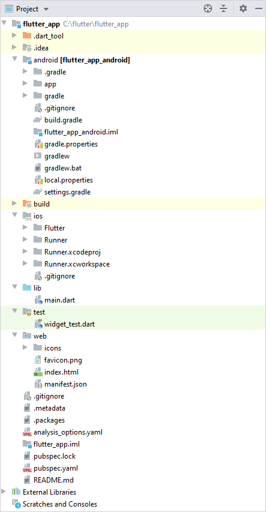
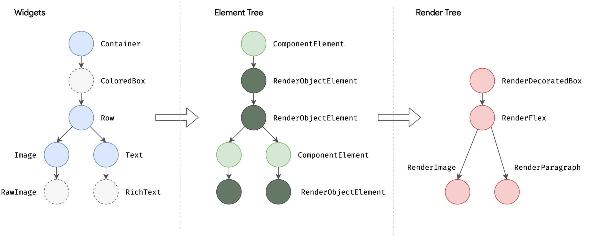

# Chapter 2: Flutter basics

In the previous chapter, we have learned about the history of cross-platform frameworks, Flutter, and Dart, and through some examples we have gained an insight into the Dart programming language. In this chapter, we will take a more detailed look into Flutter applications.

## Flutter project structure
After creating a new project in either Android Studio or Visual Studio Code, a sample project will be created with essential files already present. Let's take a closer look at the structure of the project.



The _android_ and _ios_ folders contain the platform-specific Embedder code responsible for running the Flutter Engine. These are regular projects for each platform with some Flutter build-specific variables included. With some Android or iOS knowledge, we can write platform-specific functions, which can be called from the Dart side (pun intended) with the help of platform channels. Thankfully, most of the usually necessary functionalities are also available as external packages on [pub.dev](https://pub.dev/). In a later chapter we will cover how we can write platform-specific code, and how we can use platform channels to communicate with it.

If Web support is enabled, the project will also contain a _web_ folder. Similarly to _android_ and _ios_, this folder contains the Web specific Embedder files. The Web project already qualifies as a [Progressive Web App](https://web.dev/progressive-web-apps/). Enabling any other platform (such as Windows) will similarly create a folder for that specific platform.

The _lib_ folder contains every Dart source file for our application. After generating a new project, only one file is created (`main.dart`); however, any number of sub-folders and files can be created here. By default, the `main.dart` file is the entry point of our application: this contains the `main()` function, which initializes the environment and starts the application. While it is possible to specify another file as our main entry point, the Flutter build tool uses `lib/main.dart` as the default path, so we'll also use it for now. 

> We can change the default entry point for a build started from the command line with the following command: `flutter run -t lib/custom_main.dart`

The _test_ folder contains our unit tests, with a sample test already included. This can be easily run from the editor of our choice. Note that while Flutter supports integration tests, the package for them is not included by default, and they are typically placed in the `test_driver` folder. 

While several useful files are generated in the root folder (such as the `.gitignore` file to avoid committing unnecessary files into our version control system), the `pubspec.yaml` is the most important file in our project. This file contains many essential variables, such as:

 - The name and description of our project. (Note that the application name is declared in the platform-specific embedders, so changing it here will have no effect on the generated application name).
 - The version code of our application in the format `x.y.z+w`. These values can be set to control the versioning system of the platform-specific build system. For example, the part before the `+` sign will be the `versionName` in Android and `CFBundleShortVersionString` in iOS, while the second part will be `versionCode` and `CFBundleVersion`, respectively.
 - The selected Dart SDK for our project, usually in a [version constraint format](https://dart.dev/tools/pub/dependencies#version-constraints).
 - The external dependencies in two separate groups: as a general rule, the `dependencies` section covers every dependency imported inside the `lib` folder, while the `dev_dependencies` section is for everything else (such as testing libraries and code generators).
 - Every Flutter-specific information should go under the `flutter` keyword, such as the path to our asset files.

The Dart ecosystem uses [semantic versioning](https://semver.org/spec/v2.0.0-rc.1.html). The version identifier consists of three non-negative integers, separated by dots: the major, the minor, and the patch number.
 - The patch number is incremented when a backward-compatible bugfix is implemented in the library.
 - The minor number is usually incremented when new functionality is added to the library or functions are deprecated in a backward-compatible manner. The patch number is reset to zero.
 - The major number is incremented if a backward-incompatible change is implemented in the library. The other two numbers are reset to zero.

If multiple dependencies depend on the same library transitively, only one version of the transitive dependency will be included in the project to avoid conflicting declarations. Because of this, a dependency version resolution must be made every time a dependency is changed. Luckily, this is already provided within the _dart pub_ tool. Whenever we add a dependency, we use constraints to specify which versions of a library we accept. The following constraints are supported:

 - `any` or omitted: Any version of the library can be used. This is not recommended due to possible sudden breaking changes.
 - `1.2.3`: Locks the dependency to an exact version. This leads to version locking and can easily result in unsolvable constraints. It is not recommended for library developers.
 - `>=, >, <=, <` (traditional syntax): Specify the lower and upper range, inclusive or exclusive. You can combine both of these in a single declaration to specify both.
 - `^1.2.3` (caret syntax): Use any version from the given version up to (but not including) the next major version. This is equivalent to `'>=1.2.3 <2.0.0'`. Because this is only available since Dart 1.8.3, the Dart SDK version should only be specified with the traditional syntax to ensure that older versions of the _pub_ tool do not try to process it.

We can assume that Dart library developers will use semantic versioning, so the caret syntax is recommended for general use.
While not recommended, we can also override each dependency's version in the `dependency_overrides` part. If any package is included here, *pub* will use that version instead of checking for the constraints. While this can be useful if there are incompatible packages, these can easily introduce compile-time or runtime errors, so it should only be used if necessary.
Running *pub get* will collect the required dependencies, and for every package, choose the highest version available while still fulfilling every constraint. The selected versions can be seen in `pubspec.lock`.

Dependencies can come from four different sources:

 - SDK: to specify any SDK or packages shipped within these SDK-s. Currently, only Flutter is supported as an SDK source.
 - Hosted packages: These packages are hosted on [pub.dev](https://pub.dev/) (or on any server providing the same API). This is recommended and also the default source.
 - Git packages: If the package is only available from a Git repository, we can provide the path after the `git` keyword. This can be useful if the package is proprietary since private Git repositories can be used as long as we can connect to them through SSH.
 - Path packages: These are packages stored in our local environment. In this case, the `path` keyword specifies the local path of the package. This is useful if we are developing a framework for our application in a separate package, which is not hosted anywhere.

During the course, we will be mainly using hosted packages. A detailed description (with examples) for the other types can be found [here](https://dart.dev/tools/pub/dependencies).

Another essential parts of Flutter are the asset files. These are resources that we don't want to include directly in the Dart code either because of their size (like larger JSON objects) or due to them being in a binary format (like media files). Flutter doesn't differentiate between asset files, with the only exception being font files.

Asset files can be placed anywhere inside our project structure. During the application build, every asset file specified by the _pubspec_ file will be placed inside a special asset bundle, which can be read by the application at runtime. We can either add one specific file by specifying the relative path or add every file inside a directory with the relative path to the directory. Note that the build tool only adds files inside the specified folder; files inside subfolders are not considered.

Flutter also supports the notion of _file variants_. If a file is added, the build tool will search for a file with the same name in every subdirectory of the folder the file is in. For example, consider the following folder structure (from [flutter.dev](https://flutter.dev/docs/development/ui/assets-and-images)):

```
.../pubspec.yaml
.../graphics/my_icon.png
.../graphics/background.png
.../graphics/dark/background.png
...etc.
```
And the following asset declaration:
```
flutter:
  assets:
    - graphics/
```
In this case, `graphics/background.png` is the _main_ asset file, while `/graphics/dark/background.png` is a variant (with the label _dark_) of this file. Currently, variants are only used for choosing a resolution appropriate image, but the development team may extend this to include other features.

Resolution-aware asset files can be placed inside the _Mx_ variant, where _M_ is a non-negative number (typically _2.0x_ and _3.0x_). Flutter then chooses the variant closest to the [`devicePixelRatio`](https://api.flutter.dev/flutter/dart-ui/Window/devicePixelRatio.html), which is a device-specific ratio between the logical and physical pixels. While this value can be inaccurate, the general principle is that 38 logical pixels should cover 1 centimeter (but, for example, Flutter for Web is hardcoded to use 1.0 for the devicePixelRatio, because the correct sizing is left to the browser).

Custom fonts can also be added here to be used in our application. However, we recommend using the [`google_fonts`](https://pub.dev/packages/google_fonts) package, which can download any one of over one thousand open-source fonts at runtime. If we have selected the font, we can also download and add it as an ordinary asset to avoid the delay between starting the application and showing texts with the correct font.

## Flutter UI - basics
Flutter takes inspiration from _React_ in creating the user interface by following a declarative UI design. In the more classical imperative UI (such as Android, iOS), we create the layout when the user navigates to the page, and later, when something changes, mutate some properties of these views. This separates our codebase into two main parts: creating and initializing the layout, and changing the view. We can also quickly end up in an undefined state (such as a progress bar remaining visible indefinitely when a network call throws an exception).

With declarative UI, we are only concerned _how_ a layout should look and function. For a given application state, we create a blueprint of the UI while the framework manages the layout, shifting the developers' responsibilities to the framework.

Layouts are typically defined using some XML variant. In Flutter, the development team decided instead to use Dart for layouts as well. While not ideal, this does come with some benefits:

 - The build process becomes easier to manage with only Dart code present.
 - Developers have to only know about Dart.
 - Every Dart language construct can be used while creating the layout (such as `if-else`, `for` loops).
 - Data bindings are unnecessary since variables are already available from Dart code.
 - Testing a layout becomes the same as unit testing.

In Flutter, the most important superclass is `Widget` (somewhat comparable to `View` in Android and `UIView` in iOS). As defined in the [documentation](https://api.flutter.dev/flutter/widgets/Widget-class.html), "A widget is an immutable description of part of a user interface." Indeed, `Widget` has an `@immutable` annotation, meaning that a warning will be shown if the class has any non-final fields. Because of this, every `Widget` inside the Flutter library is declared with a `const` constructor, and it is also recommended that we declare our widgets with it.

> While a `const` constructor can create a constant object, it can also be used as a regular constructor.

To create complex user interfaces, a `Widget` object can contain other `Widget` object(s). There is one root widget in every Flutter application, which will specify other widgets to add, creating a tree structure (also called _Widget tree_). Widgets can be categorized based on the number of Widgets they can contain:

- None: These widgets define a graphical user interface element. While some properties may be customizable, these are done through the parameters of the constructor. Examples include `Text`, `Image` and `ProgressIndicator`.
- One (or rarely fixed-amount): These widgets provide some kind of extra functionality to the widgets below them. This can be visible to the user (such as an `ElevatedButton`), or provide data to its child widget tree (such as `InheritedWidget` or the `Provider` library, shown later). This property is always called `child` (with the exception of `AnimatedCrossFade`, which has a `firstChild` and `secondChild` property).
- Many: These widgets are typically responsible for managing the widgets' positions in relation to each other. For example, a `Row` widget will place the widgets in a horizontal line, the `Column` widget will place the widgets in a vertical line, while the `Stack` widget will place the widgets on each other. The property for the list of widgets is called `children`.

> There are also special Widgets called Slivers. While they also extend from the `Widget` class, they can not be used in places of regular widgets. The rule is: if we have a standard widget, it can be assigned to the `child` or `children` property, while Slivers can be only assigned to the `sliver` and `slivers` property. Slivers will be mentioned in a later chapter as they are more complex.

With these in mind, let's take a closer look into a simple Flutter application:

> To enable nullability in Flutter projects, a few extra steps are needed:
>  
>  - Replace the Dart SDK constraint to the following: `sdk: '>=2.12.0-0 <3.0.0'`.
>  - Run `flutter pub get` either from the console or from the IDE.
>  - If it is enabled, there should be errors in the default project.

[DartPad](https://nullsafety.dartpad.dev/5bf4df8730d32620a955f22c33bd5819)

```dart
import 'package:flutter/material.dart';

void main() {
  runApp(MyApp("Hello 1"));
}

class MyApp extends StatelessWidget {
  final String appTitle;
  
  const MyApp(this.appTitle);
  
  @override
  Widget build(BuildContext context) {
    return MaterialApp(
      home: Scaffold(
        appBar: AppBar(
	  title: Text(appTitle),
	),
        body: MyWidget("Hello World!"),
      ),
    );
  }
}

class MyWidget extends StatelessWidget {
  final String description;
  
  const MyWidget(this.description);
  
  @override
  Widget build(BuildContext context) {
    final theme = Theme.of(context);
    return Center(
      child: Column(
        mainAxisSize: MainAxisSize.min,
        children: [
          Text(
            description,
            style: theme.textTheme.headline4,
          ),
          ElevatedButton(
            child: Container(child: Text("Press me! ")),
            onPressed: (){
              ScaffoldMessenger
                .of(context)
                .showSnackBar(
                  SnackBar(
                    content: Text("Button pressed!"),
                  ),
              );
            },
          ),
        ],
      ),
    );
  }
}
```

As with other Dart applications, our Flutter application also starts with the `main` function. Here we call the `runApp()` function, which prepares the widget tree, and attaches the given widget into the root of the tree (in our case, an instance of the `MyApp` widget). After attaching a root Widget, the Flutter framework will attach the widgets of the root widget, then their widgets until there is no widget left. 

Note that changing the parameter of the `MyApp` widget inside the `main()` function has no effect with hot-reload. Hot-reload marks the root widget for needing a rebuild. Because of this, changing the root widget will have no effect: Flutter doesn't run the `main()` function again (since that could re-initialize other important variables), and so doesn't know about the change of the root widget.

There is another way a widget may have child widget(s): through a `builder` callback function. This is either used when we have a potentially infinite number of children widgets (for example, an infinite list) or if the child widget must react to changes, commonly used with animations. For these cases, an optional `child` property is also available to avoid unnecessary widget builds, which will be passed to the callback. For example, let's suppose that we want to create a widget that rotates a child widget. In this case, we could have an animator widget, which periodically calls a callback function to create a rotation widget. The rotated widget doesn't change, and so this should be constructed beforehand and passed as a `child` parameter.

In Flutter, there are two main types of `Widget` which we usually extend: 

 - `StatelessWidget`: These widgets only depend on their current configurations (the final properties) and the _ambient state_ (these two combined will be referred to as _configuration_). _Ambient state_ is introduced into the widget tree by `InheritedWidget`(s), which the descendants can access. For example, `InheritedTheme` extends `InheritedWidget` to provide a `ThemeData` instance to descendant widgets (obtained by calling the `Theme.of()` function). We usually use the `provider` package instead. 
 - `StatefulWidget`: These widgets have a corresponding `State` object, which can contain variables. Calling the `setState()` function on the `State` object causes the widget to rebuild itself. 
 
> While a new `StatetfulWidget` instance may be created every frame, the corresponding `State` object will remain the same. 

With these in mind, let's take a look at the sample Counter application:

[DartPad](https://nullsafety.dartpad.dev/60e38246ce7b37e101bd03cd40786076)
```dart
import 'package:flutter/material.dart';

void main() {
  runApp(MyApp());
}

class MyApp extends StatelessWidget {
  @override
  Widget build(BuildContext context) {
    return MaterialApp(
      title: 'Flutter Demo',
      theme: ThemeData(
        primarySwatch: Colors.blue,
      ),
      home: MyHomePage(title: 'Flutter Demo Home Page'),
    );
  }
}

class MyHomePage extends StatefulWidget {
  MyHomePage({Key? key, this.title = ""}) : super(key: key);

  final String title;

  @override
  _MyHomePageState createState() => _MyHomePageState();
}

class _MyHomePageState extends State<MyHomePage> {
  int _counter = 0;

  void _incrementCounter() {
    setState(() {
      _counter++;
    });
  }

  @override
  Widget build(BuildContext context) {
    return Scaffold(
      appBar: AppBar(
        title: Text(widget.title),
      ),
      body: Center(
        child: Column(
          mainAxisAlignment: MainAxisAlignment.center,
          children: <Widget>[
            Text(
              'You have pushed the button this many times:',
            ),
            Text(
              '$_counter',
              style: Theme.of(context).textTheme.headline4,
            ),
          ],
        ),
      ),
      floatingActionButton: FloatingActionButton(
        onPressed: _incrementCounter,
        tooltip: 'Increment',
        child: Icon(Icons.add),
      ),
    );
  }
}
```
In this application, we count the number of times the floating action button has been pressed. Since this changes over time, it becomes a part of the application state, so a `StatefulWidget` must be used. In this case, the widget will only contain the declaration of the configuration parameters and a function to create a State object. Meanwhile, the layout will be created inside the corresponding `State` object instance. To understand this seemingly weird design choice, we have to understand how Flutter handles rendering under the hood.

## Flutter - Under the hood

While we have already seen the base class `Widget` and the widget tree, there are two other important classes: `Element` and `RenderObject` with their corresponding element and render tree.

On one side, we have the widget tree corresponding to the actual layout we want to show to the user. Note that while we refer to this as a tree, it is actually an acyclic graph since the same instance of a widget can be added multiple times. For example, adding the same `const Text("Hello World!")` text to the layout several times will point to the same object (because of the `const` constructor). While this is generally disallowed in other frameworks, Flutter can handle this because of the way widgets are defined: "A widget is an immutable description of part of a user interface". Since it is only a description, it doesn't matter whether the same or different instances of a class are added; however, we must be able to create a tree representation from it.

On the other side, we have the render tree with `RenderObject` instances. This is the equivalent class to Android's `View` and iOS's `UIView` classes. They are large (both in code size and memory footprint), complex classes, handling the layout constraints, and painting the given object with the provided options. They are usually optimized so that new paint or new layout rounds only happen when a corresponding property has changed.

In the middle stands the element tree, connecting the objects found inside the widget tree to their render objects. Their use is multi-fold. On one hand, they track the widget tree, ensuring that after the widget tree is updated, the corresponding render objects draw the correct values on the screen. On the other hand, they provide extra functionality to the widget tree: we can store values inside the `Element` objects, which can be accessed by the children widgets. This is done through the `BuildContext` object, available at every `build()` call. A widget's corresponding `State` object is also stored here, ensuring that the state object receives the new widget when it is updated.

> The `BuildContext` object received in a `build()` function is the `Element` object of the widget on which the `build()` is called. This is important because if we add multiple child widgets inside, the callback function of a child will only be able to read the ambient state from that point of the tree. We will not be able to reach an `InheritedWidget`'s data if it is added within the same widget.

When we start our application, the `runApp()` function will attach the root widget. The Flutter framework will create a corresponding `Element` instance and add it to the root of the element tree. After the element is added, the `Element` will add the next child widget(s) to the widget tree (if there is any) and create the corresponding `RenderObject` instances, adding them to the render tree if needed.

To showcase the connections between the trees, let's take a look at the following application:

[DartPad](https://nullsafety.dartpad.dev/70c13d64b2991ff0735ea863a01f59be)
```dart
import 'package:flutter/material.dart';

void main() => runApp(
  Container(
    color: Color.fromRGBO(200, 200, 200, 1.0),
    child: Row(
      textDirection: TextDirection.ltr,
      mainAxisSize: MainAxisSize.min,
      children: [
        Image.network(
          "https://flutter.dev/assets/flutter-lockup-1caf6476beed76adec3c477586da54de6b552b2f42108ec5bc68dc63bae2df75.png",
          width: 90,
        ),
        Text(
          "Hello Flutter",
          style: const TextStyle(),
          textDirection: TextDirection.ltr,
        ),
      ],
    ),
  ),
);
```
and the corresponding trees:



A built-in widget will also typically contain several children widgets within it, which are hidden from us. There will be a corresponding 'Element' object for every widget in the fully expanded widget tree. An element may or may not create a `RenderObject`.

In conclusion, the `Element` is responsible for attaching further widgets into the widget tree and attach new `RenderObject` instances to the render tree. However, to make the framework easier to use, the Flutter development team decided on transferring these responsibilities to more logical places.
In the case of `StatelessWidget`, it was logical to put the `build()` function inside the widget: we regularly have to create new widgets. This way, we avoid declaring more classes while also keeping the layout elements close to each other. 
In contrast, with `StatefulWidgets`, the `build()` function can be found inside the `State` object. While this may seem counter-intuitive initially (why is the state responsible for other widgets?), the same could be said about `StatelessWidget` (why is the configuration of a layout responsible for other configurations?). 
Indeed, the development team could have placed the `build()` function inside `StatefulWidget`, but they have decided against it for practical reasons. When we build a layout with a state, we will more likely use the variables inside the state, and so it makes sense to build our widgets within the context of the state. 

## Flutter - Keys

Until now, we have learned how Flutter can recycle memory-intensive view-like objects with the help of the three trees. One central question remains: how does the element tree change when a new widget tree is provided? In a worst-case scenario, the whole widget tree could be rebuilt only for one widget change, such as with hot reload. When is an element updated, when is it created, and when is it removed?

The general rule is that an `Element` object is constructed whenever a new widget appears somewhere in the widget tree. Changing the configuration of a widget (by creating a new instance with some properties changed) does not affect the `Element` since the type of the widget remains the same. Only when a new type of widget is added in place of the old widget or the widget is removed that the corresponding `Element` object will be removed.

An `Element` is only kept when the corresponding widget can be found in the new widget tree. Flutter uses [Linear reconciliation](https://flutter.dev/docs/resources/inside-flutter#linear-reconciliation) to find matching old and new widget pairs.

To gain an insight into how the element tree works, let's take a look at the following example:

> Please ignore the key: UniqueKey() for now. This is detrimental to our application's performance but is needed to enable hot-reload in our case and will be explained later.

[DartPad](https://nullsafety.dartpad.dev/e4176db330eb0febeebfa011fecd5e66)
 
```dart
import 'dart:math';
import 'package:flutter/material.dart';

void main() {
  runApp(MyApp());
}

class MyApp extends StatelessWidget {
  @override
  Widget build(BuildContext context) {
    return MaterialApp(
      title: 'Flutter Demo',
      theme: ThemeData(
        primarySwatch: Colors.blue,
      ),
      home: MyHomePage(key: UniqueKey(), title: 'Flutter Demo Home Page'),
    );
  }
}

class MyHomePage extends StatefulWidget {
  MyHomePage({Key? key, this.title = ""}) : super(key: key);

  final String title;

  @override
  _MyHomePageState createState() => _MyHomePageState();
}

class _MyHomePageState extends State<MyHomePage> {
  final List<Widget> _myColorWidgets = [
    StatelessColorWidget(color: Colors.red),
    StatelessColorWidget(color: Colors.blue),
  ];

  void _reverseList() {
    setState(() {
      var temp = _myColorWidgets[0];
      _myColorWidgets[0] = _myColorWidgets[1];
      _myColorWidgets[1] = temp;
    });
  }

  @override
  Widget build(BuildContext context) {
    return Scaffold(
      appBar: AppBar(
        title: Text(widget.title),
      ),
      body: Center(
        child: Column(
          mainAxisAlignment: MainAxisAlignment.center,
          children: <Widget>[
            Text(
              'My colored widgets: ',
            ),
            ..._myColorWidgets
          ],
        ),
      ),
      floatingActionButton: FloatingActionButton(
        onPressed: _reverseList,
        tooltip: 'Reverse',
        child: Icon(Icons.swap_vert),
      ),
    );
  }
}

class StatelessColorWidget extends StatelessWidget{
  final Color color;

  const StatelessColorWidget({Key? key, this.color = Colors.transparent}) : super(key: key);

  @override
  Widget build(BuildContext context) {
    return Container(
      width: 120,
      height: 40,
      color: color,
    );
  }
}

class RandomColorWidget extends StatefulWidget {
  const RandomColorWidget({Key? key}) : super(key: key);

  @override
  _RandomColorWidgetState createState() => _RandomColorWidgetState();
}

class _RandomColorWidgetState extends State<RandomColorWidget> {
  late Color currentColor;

  @override
  void initState() {
    var rnd = Random();
    currentColor = Color.fromRGBO(rnd.nextInt(256), rnd.nextInt(256), rnd.nextInt(256), 1);
    super.initState();
  }

  @override
  Widget build(BuildContext context) {
    return StatelessColorWidget(
      color: currentColor,
    );
  }
}
```
The goal of our application is simple: we have two colored boxes, and we want to swap them at the press of the floating action button. For the colored boxes, we have two types: the `StatelessColorWidget` takes a color parameter and draws it, while the `RandomColorWidget` generates a random color when created. We cache these two widgets inside the state of the `MyHomePage` widget.

In the first case, we have two `StatelessColorWidget`s. On the press of the button, we can see that the colors of the boxes have indeed changed, but not necessarily the way we intended. 

When we press the button, the `setState()` function is called, which will mark the widget in need of a rebuild. This will result in the `build()` function being called, where the widgets will have been swapped by now. The element tree notices the change and will start matching the widgets to their `Element` objects. Since two different instances of a widget can still represent the same layout (for example, when a text is changed), they can't use the `==` operator to match the widgets. Instead, the best thing they can do is to make sure that the type of the old widget (`runtimeType`) matches the new widget. 

Because both of the widgets are of the type `StatelessColorWidget`, the order of the element tree objects will remain the same (meaning that widgets assigned to the corresponding elements have now been swapped). In the next step, the `Element` object checks if the new widget is the same as the old one with the `==` operator. Since the widgets have been swapped, this will return false, and so these widgets will be marked for a rebuild. With the `build()` functions called, a new `Container` with the correct color is returned, which will update the corresponding `RenderObject`, and so the colors are drawn in the correct order. 
This can also be seen if we put a breakpoint inside the `StatelessColorWidget` `build()` function.

Now let's change the `StatelessColorWidget` into `RandomColorWidget` (removing the color parameter). With this, the swap will not work. Since a State object is associated with the `Element` object, and as we have seen in the previous example, the `Element` objects did not swap places, the `State` objects will also remain in place. Because the widgets are swapped, the `build()` function will still be called, but the `State` object returns the same widget, and so no changes can be seen.

For our next experiment, let's wrap one of the `RandomColorWidget`s with a `Container`. Running our application now, we will see something different: while the colors change, they are changing to random values. In this case, when the matching of the old widget to the new widget happens, the `runtimeType` of the widgets are different. In this case, Flutter will first remove the corresponding `Element` objects and create new `Element`s with their own `State` objects, which will generate a new color.

To solve these issues, the `Key` class was introduced. A key can be thought of as an identifier of a `Widget` (or also for an  `Element` or `SemanticNode`). There are several different keys:

 - `LocalKey`: Identifies a widget within the children of the same parent widget. Must be unique in this context.
   - `UniqueKey`: A key that is only equal to itself.
   - `ValueKey`: A key that is equal to another key if and only if the values (assigned in the constructor of the key) are equal (checked with the `==` operator).
   - `ObjectKey`: Similar to `ValueKey`, but the references to the object are compared (`identical` returns true).
 - `GlobalKey`: Identifies a widget in the application. Must be unique within the whole app. Having two widgets within the tree with the same `GlobalKey` will cause an exception.  

While `GlobalKey`s are more expensive to use, they also offer some useful functionality thanks to them being unique: using a `GlobalKey`, we can reach the corresponding `Widget`, `Element`, and (if it exists) `State` objects. An example of this is [form validation](https://flutter.dev/docs/cookbook/forms/validation#1-create-a-form-with-a-globalkey).

Returning to our example, adding keys to the correct widgets will solve our problems. In this case, we have to add keys where the order of the widgets change, that is, in the list declaration. Because we cache the widgets inside the `_MyHomePageState`, using `UniqueKey`s are correct. However, if we create new widgets at every build function, we must use `ValueKey` (with some unique id value) or `ObjectKey`(with the object responsible for the given widget), such as in dynamic lists.

While keys were needed to make sure that the `State` objects move correctly with the widgets, they can also be useful for `StatelessWidget` instances. In this case, Flutter will be able to match the same instances of the widgets from before, and the `build()` function will not be called. Note that this only applies because we create the widgets when the `State` is created. If new widgets were created inside the `build()` function, their `build()` function would also be called since they are not identical (and Flutter doesn't recommend overwriting the `==` operator, see [here](https://github.com/flutter/flutter/issues/49490).

Now let's return to the `UniqueKey` inside the `MyApp` widget. If we were to remove it, we could see that hot reload no longer works when changing the widgets inside. This is because the colored widgets are cached inside the state. Hot reload marks the root widget for a rebuild, which will create a new `MyHomePage` widget, but as we have seen before, the `State` object will remain. Assigning a new `UniqueKey` will mark the new `MyHomePage` widget to be different from the old one, and so the previous `State` object will be destroyed, and a new instance will be created with the updated `State` class.

## Conclusion

In this chapter, we have learned the structure of a basic Flutter project. We have learned about widgets, the three trees, and how we can create our widgets with `StatelessWidget` and `StatefulWidget`. We have also seen how Flutter manages to synchronize the widget and the element tree and how using keys can help us avoid problems when the widget tree is changed. In the next chapter, we will learn about the basic widgets provided by the Flutter framework, with which we can create our layouts.  
