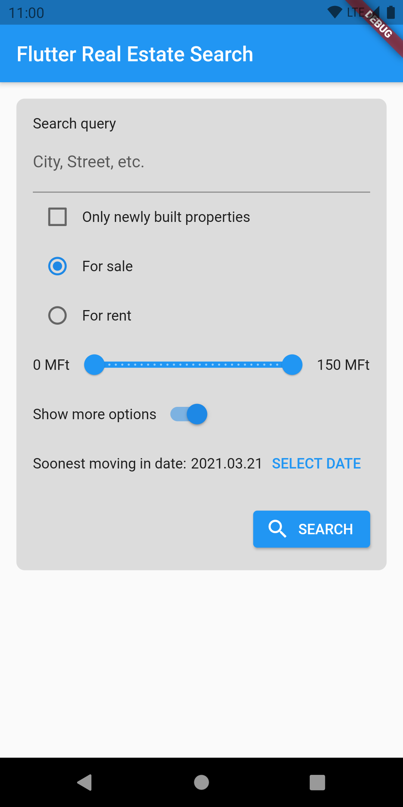
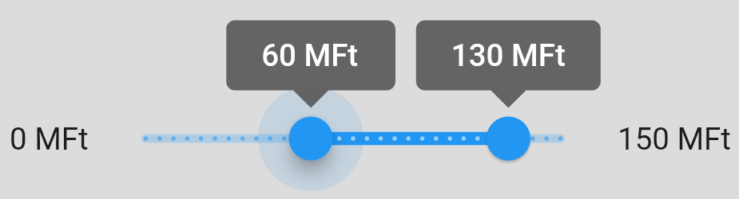
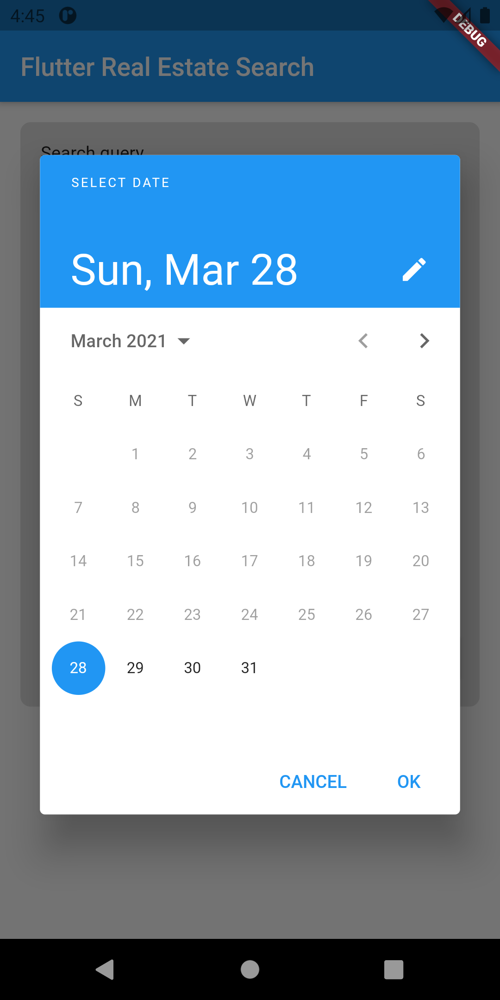
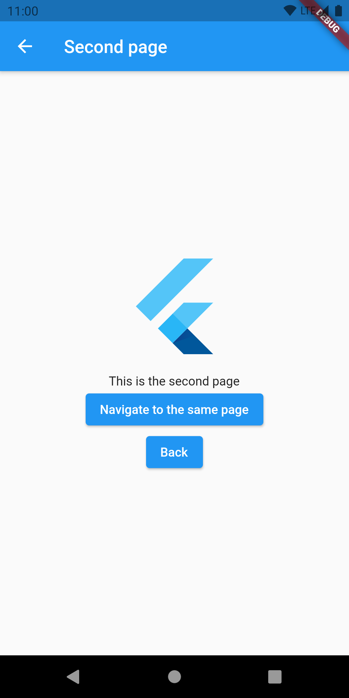
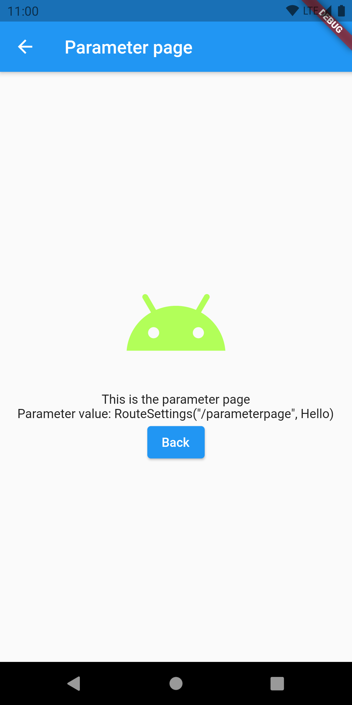
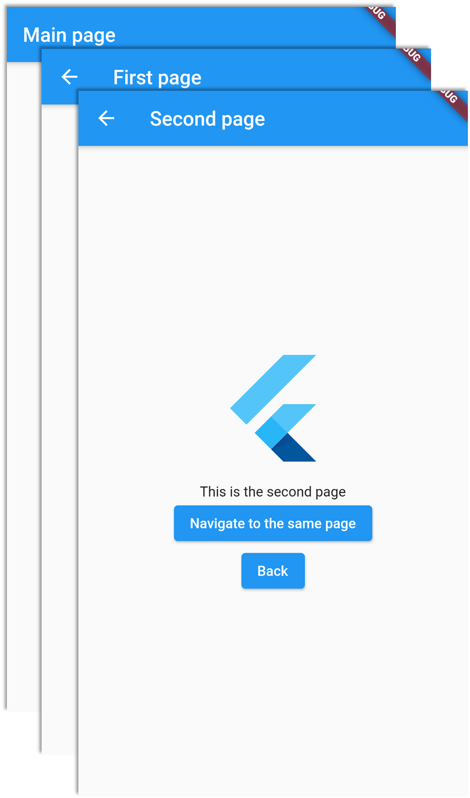
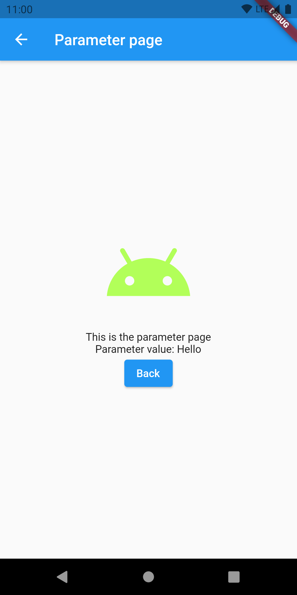
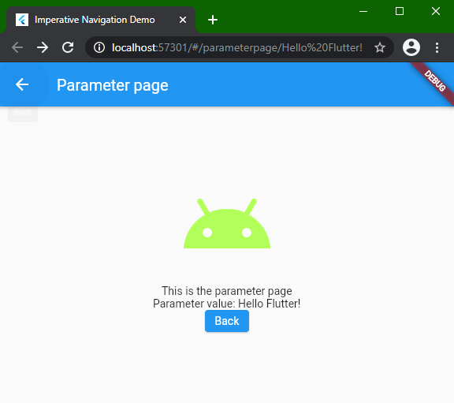

# Chapter 7: Advanced widgets, navigation, animation

## Input widgets

Input widgets do what their category name suggests. They are responsible for capturing input events, and they enable the user to interact with our app. Flutter has implementations for all the input widgets we are used to seeing and using in applications with graphical UIs. In the first section of this chapter, we'll see how we can use the most common input widgets.

The example project for this section is [*input_widgets_demo*](../projects/chapters/chapter_07/input_widgets_demo), and it implements a search form page with some reasonable input choices:



The page is implemented in [*form/real_estate_search_form_page.dart*](../projects/chapters/chapter_07/input_widgets_demo/lib/inputs_demo/form/real_estate_search_form_page.dart), and its entire state is handled by a single Cubit which is implemented in [*bloc/real_estate_search_form_cubit.dart*](../projects/chapters/chapter_07/input_widgets_demo/lib/inputs_demo/bloc/real_estate_search_form_cubit.dart).

Let's go through each input widget type from top to bottom and see how we can use them.

### TextField 

[`TextField`](https://api.flutter.dev/flutter/material/TextField-class.html) is responsible for collecting written user input. While `TextField` has all the bells and whistles that most UI toolkits offer in their input field implementations, let's focus on just a few important aspects of text input handling: showing a label or hint and using the value given by the user.

Implementing an animated label defined by Material Design is relatively easy with Flutter. We only have to provide an `InputDecoration` with a label text to get these results:

|  No focus and value    |  Has focus and value    |
| :----: | :----: |
|      |      |

As for handling the value, we have to declare and create a [`TextEditingController`](https://api.flutter.dev/flutter/widgets/TextEditingController-class.html) instance and pass the reference of it to the `TextField` when it is built.

```dart
final queryTextController = TextEditingController();

TextField(
  decoration: const InputDecoration(
    labelText: "City, Street, etc.",
  ),
  controller: queryTextController,
),
```

> We can do much more customization with `InputDecoration`. Feel free to experiment with its parameters.

We can access the current value entered into the `TextField` like this (the example is taken from the search button's `onPressed` handler):

```dart
ScaffoldMessenger.of(context).showSnackBar(
  SnackBar(
    content: Text(queryTextController.value.text), // <- this
  ),
);
```

We shouldn't forget to dispose of all `TextController`s in the `State`'s `dispose()` method to avoid memory leaks:

```dart
@override
void dispose() {
  queryTextController.dispose();
  super.dispose();
}
```

### Checkbox

[`Checkbox`](https://api.flutter.dev/flutter/material/Checkbox-class.html)es are really easy and intuitive to use in Flutter. The following snippet is from [*checkbox_row.dart*](../projects/chapters/chapter_07/input_widgets_demo/lib/inputs_demo/form/widgets/checkbox_row.dart):

```dart
class CheckboxRow extends StatelessWidget {
  @override
  Widget build(BuildContext context) {
    final isNewlyBuiltChecked =
        context.watch<RealEstateSearchFormCubit>().state.isNewlyBuiltChecked;
    return Row(
      children: [
        Checkbox(
          value: isNewlyBuiltChecked,
          onChanged: (checked) {
            if (checked != null) {
              context.read<RealEstateSearchFormCubit>().newlyBuiltCheckedChanged(checked);
            }
          },
        ),
        Text("Only newly built properties")
      ],
    );
  }
}
```

As we can see, a `Checkbox` only needs its current value at the time of rebuilding, and we can add a listener (`onChanged`) to be called when the `Checkbox`'s value is changed. In this example, the current value comes from our Cubit, while the value change event is propagated back to the Cubit, where the state of the UI can be updated. As that being said, a `Checkbox`'s visual appearance will not change automatically when `onChanged` is called.

### Radio group

The concept of radio groups in Flutter is closer to the [web's implementation](https://www.w3schools.com/tags/att_input_type_radio.asp), rather than [Android's](https://developer.android.com/guide/topics/ui/controls/radiobutton) or iOS's (which doesn't exist in the native UI toolkit), although there's a little twist in the actual approach.

The following snippet is from [*radio_group.dart*](../projects/chapters/chapter_07/input_widgets_demo/lib/inputs_demo/form/widgets/radio_group.dart):

```dart
class RadioGroup extends StatelessWidget {
  @override
  Widget build(BuildContext context) {
    final selectedSearchType = context.watch<RealEstateSearchFormCubit>()
        .state.propertySearchType;
    return Column(
      children: [
        Row(
          children: [
            Radio(
              value: PropertySearchType.forSale, // <- the value this Radio represents
              groupValue: selectedSearchType, // <- the current value of the radio group
              onChanged: (value) {
                context.read<RealEstateSearchFormCubit>().setPropertySearchType(PropertySearchType.forSale);
              },
            ),
            const Text("For sale"),
          ],
        ),
        Row(
          children: [
            Radio(
              value: PropertySearchType.forRent, // <- the value this Radio represents
              groupValue: selectedSearchType, // <- the current value of the radio group
              onChanged: (value) {
                context.read<RealEstateSearchFormCubit>().setPropertySearchType(PropertySearchType.forRent);
              },
            ),
            const Text("For rent"),
          ],
        ),
      ],
    );
  }
}
```


For each [`Radio`](https://api.flutter.dev/flutter/material/Radio-class.html) widget, we have to specify the `value` it *represents* and the value of the *abstract radio group* it belongs to - `groupValue`. A `Radio` is selected if the `value` and the `gorupValue` are equal when the `Radio` is built. This implies that if two (or *n*) `Radio`s with different `value`s are linked by the same `groupValue` variable, they act as a radio group. 

If we want to change the state of a `Radio`, we have to specify a listener with the `onChanged` parameter, where we should trigger the rebuild of the `Radio`, or more likely, the parent of multiple `Radio`s as in our example. Bear in mind that `Radio` *will not change state* by itself when `onChanged` is called (just like in `Checkbox`'s case).

### Sliders

We can use the [`Slider`](https://api.flutter.dev/flutter/material/Slider-class.html) and [`RangeSlider`](https://api.flutter.dev/flutter/material/RangeSlider-class.html) widgets to enable the user to select a value from a range of values or select two values as lower and higher ends of a value range. We can also limit the values that can be selected in the range.

The following code is an example for the usage of the `Slider` widget:

```dart
class SliderRow extends StatelessWidget {
  @override
  Widget build(BuildContext context) {
    final state = context.watch<RealEstateSearchFormCubit>().state;
    final maxPriceValue = state.maxPriceValue;
    return Row(
      mainAxisAlignment: MainAxisAlignment.spaceEvenly,
      children: [
        Text("${MIN_PRICE.round()} MFt"),
        Expanded(
          child: Slider(
            value: maxPriceValue,
            min: minPrice,
            max: maxPrice,
            divisions: 30,
            label: "${maxPriceValue.round().toString()} MFt",
            onChanged: (value) {
              context.read<RealEstateSearchFormCubit>().onPriceValueChanged(
                    value,
                  );
            },
          ),
        ),
        Text("${MAX_PRICE.round()} MFt"),
      ],
    );
  }
}
```


As with `Checkbox` and `Radio` before, the `value` parameter denotes the `Slider`'s value when it is rebuilt. There's also the familiar `onChanged` callback which we can refresh the UI state in. Besides those parameters, we have control over the minimum and maximum value of the selectable range, the number of divisions between those values on the `Slider`, and the text on the label associated with the selection handle (displaying 105 MFt on the screenshot above). There are more styling and event-related parameters for `Slider`, but these are the ones we'll be using most of the time.

> The `divisions` parameter is a bit tricky. As we can see, `min` and `max` are `double` values. If we don't define `divisions`, the `Slider` will allow the selection on a *continuous* range of values between `min` and `max`. Specifying `divisions` enables the selection of discrete values within the range.

We can make a `RangeSlider` out of the `Slider` sample above with minimal modifications. The following snippet is from [*slider_row.dart*](../projects/chapters/chapter_07/input_widgets_demo/lib/inputs_demo/form/widgets/slider_row.dart):

```dart
class SliderRow extends StatelessWidget {
  @override
  Widget build(BuildContext context) {
    final state = context.watch<RealEstateSearchFormCubit>().state;
    final minPriceValue = state.minPriceValue;
    final maxPriceValue = state.maxPriceValue;
    return Row(
      mainAxisAlignment: MainAxisAlignment.spaceEvenly,
      children: [
        Text("${MIN_PRICE.round()} MFt"),
        Expanded(
          child: RangeSlider(
            values: RangeValues(minPriceValue, maxPriceValue),
            min: minPrice,
            max: maxPrice,
            divisions: 30,
            labels: RangeLabels(
              "${minPriceValue.round().toString()} MFt",
              "${maxPriceValue.round().toString()} MFt",
            ),
            onChanged: (values) {
              context.read<RealEstateSearchFormCubit>().onPriceValuesChanged(
                    values.start,
                    values.end,
                  );
            },
          ),
        ),
        Text("${MAX_PRICE.round()} MFt"),
      ],
    );
  }
}
```



The main difference between the `Slider` and the `RangeSlider` widgets is that `RangeSlider` deals with two values and two labels instead of one.

### Switch

The usage and behavior of the [`Switch`](https://api.flutter.dev/flutter/material/Switch-class.html) widget is exactly the same as `Checkbox`'s.

The following snippet is from [*switch_row.dart*](../projects/chapters/chapter_07/input_widgets_demo/lib/inputs_demo/form/widgets/switch_row.dart):

```dart
class SwitchRow extends StatelessWidget {
  @override
  Widget build(BuildContext context) {
    final isShowingDetailedSearch = context
        .watch<RealEstateSearchFormCubit>()
        .state
        .isShowingDetailedSearch;
    return Row(
      children: [
        const Text("Show more options"),
        Switch(
          value: isShowingDetailedSearch,
          onChanged: (value) {
            context
                .read<RealEstateSearchFormCubit>()
                .setDetailedSearchVisible(value);
          },
        )
      ],
    );
  }
}
```

Syntactically we're doing the same thing here as what we're doing in *checkbox_row.dart*. However, the state value this `Switch` controls is also used in [*date_chooser.dart*](../projects/chapters/chapter_07/input_widgets_demo/lib/inputs_demo/form/widgets/date_chooser.dart) to determine if a particular part of the UI is needed to be displayed or not.

```dart
@override
Widget build(BuildContext context) {
  final state = context.watch<RealEstateSearchFormCubit>().state;
  final isShowingDetailedSearch = state.isShowingDetailedSearch;
  // ...
  if (isShowingDetailedSearch) {
    return Row(...);
  } else {
    return Container();
  }
}
```

|  Switch is off    |  Switch is on    |
| :----: | :----: |
|      |      |

> In declarative UI frameworks, such as Flutter, Jetpack Compose (Android), and SwiftUI (iOS), this is the most basic way to show or hide a part of a UI. We either build or don't build a UI section.

### Date picker

The Material Design implementation of Flutter provides two Material-themed temporal picker dialogs (date and time) out of the box. They can be displayed and used by calling their respective functions (`showDatePicker` and `showTimePicker`) and awaiting the result of those functions.

The following snippet is from [*date_chooser.dart*](../projects/chapters/chapter_07/input_widgets_demo/lib/inputs_demo/form/widgets/date_chooser.dart), and it shows how to display a date picker dialog:

```dart
void showSoonestMovingInDatePicker(BuildContext context, DateTime initialDate) async {
  final now = DateTime.now();
  final date = await showDatePicker(
    context: context,
    initialDate: initialDate,
    firstDate: now,
    lastDate: DateTime(now.year + 1, now.month, now.day),
  );
  if (date != null) {
    context.read<RealEstateSearchFormCubit>().setSoonestMovingInDate(date);
  }
}
```



When the date picker dialog returns with a date (and not `null`), we update the UI state to show the newly selected date.

## Navigation

As we can already know from previous chapters, screens in Flutter are basically just widgets (remember, everything is a widget!). The terminology of Flutter for a screen is "page".

There are a few approaches we can choose for navigating between pages. There is the older, but still versatile Navigator 1.0, which was Flutter's first solution for navigation, and the newer, shinier, declarative approach called Navigator 2.0.

As navigation is already a complex topic by itself without the added complexity of Navigator 2.0, we will stick to using Navigator 1.0 for now.

> To learn more about Navigator 2.0 and the differences between the two frameworks, check out the [Navigation and routing](https://flutter.dev/docs/development/ui/navigation) page of the official documentation, along with [this artice](https://medium.com/flutter/learning-flutters-new-navigation-and-routing-system-7c9068155ade). Feel free to experiment with 2.0.

While we'll be using Widgets as pages of our apps, the widgets themselves know nothing about themselves being *pages*. For a widget to behave as a page, it needs to be wrapped inside a [`Route`](https://master-api.flutter.dev/flutter/widgets/Route-class.html) implementation - either [`MaterialPageRoute`](https://master-api.flutter.dev/flutter/material/MaterialPageRoute-class.html), [`CupertinoPageRoute`](https://master-api.flutter.dev/flutter/cupertino/CupertinoPageRoute-class.html), or a custom implementation - which holds data about the navigation state and behavior.

> As in previous chapters, for the sake of simplicity, we'll only be looking at Material implementations. However, the following examples are easily adaptable to Cupertino.

### Imperative navigation - Navigator 1.0

The following examples can be found in the [navigation_imperative](../projects/chapters/chapter_07/navigation_imperative) project.

Let's open the *main.dart* file in the project, which contains the `main()` function of the app and the app widget, which wraps a `MaterialApp` widget. There are already some navigation related parameters set, but before diving into those details, let's check out the `home` parameter of `MaterialApp`'s constructor.

```dart
MaterialApp(
  title: 'Imperative Navigation Demo',
  theme: ThemeData(
    primarySwatch: Colors.blue,
    visualDensity: VisualDensity.adaptivePlatformDensity,
  ),
  home: MainPage(), // <-- this
  ...
);
```

The `home` parameter has a relatively extensive documentation, but in a nutshell, if it is set, the provided Widget (tree) will be the landing page of the app. In web and URI terms, the home page will be on the root ("/") path. Building and running the project yields the following state:


#### The navigation parameters of `MaterialApp`

Before discussing the contents of `MainPage`, let's take a step back and look at the other navigation related parameters of `MaterialApp`. The first thing to notice is the `routes` parameter, which takes a `Map` having `String` keys and `Widget` building lambda functions as values.

```dart
MaterialApp(
  ...
  routes: {
    "/firstpage": (context) => FirstPage(),
    "/secondpage": (context) => SecondPage(),
  },
  ...
);
```

This is how we can define the top-level static routing table of an application and this enables navigation directly by route names. The starting slash in the route names are not necessary, but keeping the URI format in route names definitely helps when targeting the Web.

We can, in fact, define the home page by providing a route in `routes` with the key "/" (the root path), but doing so while also using the `home` parameter will result in a runtime assertion error. 

>This behavior is well-documented in both `home`'s and `routes`' inline documentation:
>`home`: "If `home` is specified, then `routes` must not include an entry for /, as home takes its place."
>`routes`: "If `home` is specified, then it implies an entry in this table for the `Navigator.defaultRouteName` route (/), and it is an error to redundantly provide such a route in the `routes` table.

There are two more parameters we'll be using in our navigation example: `onGenerateRoute` and `onUnknownRoute`.

```dart
MaterialApp(
  ...
  onGenerateRoute: (route) {
    return null;
  },
  onUnknownRoute: (route) {
    return MaterialPageRoute(
      builder: (_) => ParameterPage(
        parameter: route.toString(),
      ),
    );
  },
);
```

The `onGenerateRoute` callback allows us to handle navigation to named routes that are not listed in the static routing table (`routes`). The object we receive here as input is of the [`RouteSettings`](https://master-api.flutter.dev/flutter/widgets/RouteSettings-class.html) type and contains the requested route and the arguments associated with the navigation request. The `arguments` object is delivered as an `Object?` instance and it's up to us to cast it and parse the contents before usage.

> Navigation arguments are usually used for passing data between screens. A typical example of this is a list-detail app, where clicking a list item takes the user to the details screen, passing the selected item's ID to it for the screen to know which item's details it has to load.

It is possible that we receive a route name that we are not prepared to handle. In this case we can return a default Widget of our choice, or `null` from `onGenerateRoute`. In the latter case, the `onUnknownRoute` callback will be called, where we get the last chance to show at least a meaningful error or explanation page to the user.

The situation we just discussed can be rather strange to mobile app developers. How can we get a navigation request which's route doesn't exist? One way would be to receive a deep link from a notification that the app cannot handle (this would imply that a poor choice has been made somewhere in the release cycle, though). However, remember that we can target the Web with Flutter, which world's navigation is based on URIs. If we were to request a web app's resource by URI that doesn't exist, we are most likely to be presented with some form of a 404 (resource *not found*) page. This behavior is what we can achieve by using `onGenerateRoute` or  `onUnknownRoute`, and it is also suitable for mobile and desktop targets alike.

> Although we *can* use `onGenerateRoute` to implement the "404" page (with a non-`null` return value when we couldn't handle the received route), `onUnknownRoute` is *the* place to do it by design.

If we set `home`, `routes`, `onGenerateRoute`, and `onUnknownRoute`, `MaterialApp` creates a `Navigator` widget and makes all pages to be its children from that point on. Technically speaking, that `Navigator` will be the (in)direct parent of all pages, so the pages will be able to acquire a reference to the `Navigator` with a `Navigator.of(context)` call.

Routes managed by a `Navigator` are organized in a *navigation stack*, and as so, operations like `push` and `pop` are available on the `Navigator`. 

Now, let's look at the pages we will be navigating between.

#### The home page

The app's home page, `MainPage`, is also implemented in the *main.dart* file. `MainPage` has a rather simple, `Scaffold` based structure. However, `Scaffold` is not the root widget of the page. It's wrapped in a `WillPopScope` widget.

```dart
class MainPage extends StatelessWidget {
  @override
  Widget build(BuildContext context) {
    return WillPopScope( // <- this
      onWillPop: () async {
        var result = await showDialog(
          context: context,
          builder: (context) {
            return AlertDialog(
              title: const Text("Are you sure?"),
              content: const Text("Do you really want to quit?"),
              actions: [
                TextButton(
                  child: const Text("No"),
                  onPressed: () => Navigator.pop(context, false),
                ),
                TextButton(
                  child: const Text("Yes"),
                  onPressed: () => Navigator.pop(context, true),
                ),
              ],
            );
          },
        );
        return result ?? false;
      },
      child: Scaffold(...),
    );
  }
}
```

> In app navigation terms, *pop* means taking the top-most page off the navigation stack, which (in most cases!) is equivalent to *navigating to the previous page*.

The `WillPopScope` widget provides a callback for vetoing back navigation attempts originating from `WillPopScope`'s direct child. In this app, we use this mechanism to show a dismissable `AlertDialog` with two buttons when the user tries to navigate backward from the home page (essentially, when they try to leave the app). Dismissing the dialog, or clicking the *No* button vetoes the back navigation, while clicking the *Yes* lets the navigation event go though, exiting the app.

`MainPage`'s actual content consists of a title `Text` and four `ElevatedButton`s in a `Column`, which all have a navigation-related action set to them. Jumping right to the bottom one (*Go back*), we can see how to handle vetoable back navigation:

```dart
ElevatedButton(
  child: const Text("Go back"),
  onPressed: () async {
    var handledPop = await Navigator.maybePop(context); // <- here
    if (!handledPop) {
      SystemNavigator.pop();
    }
  },
),
```

> Throughout this project, we use the `Navigator.[functionName](context)` style functions, which are just wrappers around the `Navigator.of(context).[functionName]()` style functions. The reason for doing so is that the former style hides the fact that we can access the `Navigator` of the `MaterialApp` via an `InheritedWidget`, and it's more concise too.

`maybePop` returns `true` if the pop event was vetoed, and `false` if the pop event can go through. By calling `maybePop` here, the enclosing `WillPopScope`'s `onWillPop` callback is called. If we can continue exiting the app, we call `SystemNavigation.pop()` and basically exit the app. This is the recommended way to exit the app programmatically in favor of *dart.io*'s `exit` method, because this way the app closes normally as far as the underlying platform is concerned, while calling `exit()`  may count as a crash.

#### Named navigation

Clicking one of the rest of `MainPage`'s buttons results in a *named* navigation attempt by calling `Navigator.pushNamed(context, name)`.

```dart
ElevatedButton(
  child: const Text("Go to first page"),
  onPressed: () {
    Navigator.pushNamed(
      context,
      "/firstpage",
    );
  },
),
ElevatedButton(
  child: const Text("Go to second page"),
  onPressed: () {
    Navigator.pushNamed(
      context,
      "/secondpage",
    );
  },
),
ElevatedButton(
  child: const Text("Go to parameter page"),
  onPressed: () {
    Navigator.pushNamed(
      context,
      "/parameterpage",
      arguments: "Hello",
    );
  },
),
```

When we initiate a named navigation, `Navigator` will try to look up the provided name in the routing table (defined in `MaterialApp`'s `routes` parameter). If a requested route exists in the routing table, navigation to the route's target page will happen. We've already discussed what happens when a requested named route is not in the routing table in [the previous section](#the-navigation-parameters-of-materialapp).

Navigating to named routes `"/firstpage"` and `"/secondpage"` from `MainPage` is straightforward, as those routes are in the routing table.

|                   /firstpage                   |                   /secondpage                    |
| :--------------------------------------------: | :----------------------------------------------: |
|  |  |

Clicking the *Go to parameter page* button on `MainPage` fires a navigation event, passing extra data - an argument object - to it. The navigation argument is handled as  `Object?`, so we can pass any type of object to it, and, more importantly, we are responsible for casting it properly when processing it.

```dart
ElevatedButton(
  child: const Text("Go to parameter page"),
  onPressed: () {
    Navigator.pushNamed(
      context,
      "/parameterpage",
      arguments: "Hello", // <- navigation argument object
    );
  },
),
```

Navigation from `MainPage` to `"/parameterpage"` will result in a call to `onUnknownRoute`, where we manually create a `MaterialPageRoute` that wraps a `ParameterPage` and passes the `String` representation of the received `RouteSettigns` object to it. As we can see, the provided `RouteSettings` object contains the name of the requested route and the navigation argument object - in this case, the `String` "Hello".



#### Anonymous navigation

The `FirstPage` (in *first_page.dart*) implements the page widget associated with the `"/firstpage"` route. The *Navigate to second page* button's click listener implements a so-called *anonymous navigation* by calling `Navigator.push`. This way, we have to manually create a `Route` instance - like a `MaterialPageRoute` - and use it to declare the navigation target page explicitly.

```dart
ElevatedButton(
  child: Text("Navigate to second page"),
  onPressed: () {
    Navigator.push( // <- anonymous navigation
      context,
      MaterialPageRoute(
        builder: (context) => SecondPage(), // <- navigation target 
      ),
    );
  },
),
```

This approach grants more freedom than navigating between predefined named routes only, as we can technically navigate to any widget of our choice. On the other hand, using *only* anonymous navigation is not scalable in large projects.

Clicking the *Navigate to second page* button pushes a route containing a `SecondPage` instance. At this point, our navigation stack looks like this:



Clicking the *Back* button on either `FirstPage` or `SecondPage` calls `Navigator.pop()`, which results in popping the top-most page off the current stack, which equals to a back navigation in our example.

`SecondPage`'s *Navigate to same page* button does a slightly different navigation that we've seen so far. It replaces the top route on the stack with the newly created one. In practice this means that clicking the *Navigate to same page* any number of times won't add a new stack entry, but the current `SecondPage` instance will be replaced with a new one. Also, clicking the *Back* button on `SecondPage` after that will result in a single back navigation event to the previous page.

> `SecondPage` is actually reachable directly from `MainPage`. Taking that route builds a navigation stack of  `MainPage`->`SecondPage` and the behavior described above stays the same logically.

#### Handling generated routes

Let's get back to the  `MaterialApp` widget in *main.dart* and handle `"/parameterpage"` as a generated route.

```dart
MaterialApp(
  ...
  home: MainPage(),
  routes: {
    "/firstpage": (context) => const FirstPage(),
    "/secondpage": (context) => const SecondPage(),
  },
  onGenerateRoute: (route) {
    switch (route.name) { // <- here
      case "/parameterpage":
        return MaterialPageRoute(
  	      settings: const RouteSettings(name: "/parameterpage"),
  		  builder: (context) => ParameterPage(
    	    parameter: route.arguments.toString(),
  		  ),
	    );
    }
    return null;
  },
  onUnknownRoute: (route) {
    return MaterialPageRoute(
      builder: (_) => ParameterPage(
        parameter: route.toString(),
      ),
    );
  },
);
```

The object we receive in the `onGenerateRoute` callback is an instance of the previously mentioned `RouteSettings` class. It holds the requested route name and the arguments object bundled with the navigation request. It's up to us to build and return a `MaterialPageRoute` based on the received data (or `null`, of course).

This time, we'll build a route to `ParameterPage` with an actual argument object passed to it - which is still the "Hello" `String`, but now `ParameterPage` will print just that instead of the whole `RouteSettings` object as a `String`. 



#### Navigation on the Web

We've seen that the navigation methods shown above work quite well on the mobile targets. What about the Web target, where navigation is usually based on URIs?

Well, by using named navigation routes, we already have this base covered, too. Let's build and run the app for the web target.


As we can see, the URL of the landing page of the app looks like this: `host/#/`. If we navigate to one of the named routes registered in the routing table, the name of the current route is appended to the URL.

| First page | Second page |
| :----: | :----: |
|      |      |

> Note that this example app is not complete, so there may be navigation glitches if we tried to access pages by modifying the URL directly.

However, navigating to the `ParameterPage` from the `MainPage` yields a slightly different result:


The web URL of a navigation page comes from it's route name, which generated routes don't have by default. Fixing this is as easy as adding a `RouteSettings` object to the generated route:

```dart
onGenerateRoute: (route) {
  switch (route.name) {
    case "/parameterpage":
      return MaterialPageRoute(
        settings: const RouteSettings(name: "/parameterpage"), // <- here
        builder: (context) => ParameterPage(
          parameter: route.arguments.toString(),
        ),
      );
  }
  return null;
},
```

The URL is properly updated now when navigating to `ParameterPage`.


We can even add URL parameter handling by doing some custom computation in `onGenerateRoute`:

```dart
onGenerateRoute: (route) {
  if (route.name?.contains("/parameterpage/") ?? false) {
    final routeName = route.name!;
    final arg =
        routeName.substring(routeName.lastIndexOf("/")+1, routeName.length);
    return MaterialPageRoute(
      settings: RouteSettings(name: "/parameterpage/$arg"),
      builder: (context) => ParameterPage(
        parameter: Uri.decodeFull(arg),
      ),
    );
  }
  return null;
},
```



### Navigation with Pages - an intro to Navigator 2.0

The following examples can be found in the [navigation_pages](../projects/chapters/chapter_07/navigation_pages) project.

Navigator 2.0 has many extra features over Navigator 1.0, but we'll stick to some basic improvements that 2.0 introduced. We'll see how we can manage the navigation stack as a part of the app state.

The example project of this section implements exactly the same functionality that we saw in the imperative navigation sample project. The only difference is in the implementation of navigation.

After opening *main.dart*, we can instantly see that there is a `GlobalKey` named `globalNavigatorHolderKey`. We're using this key to access the custom navigation-stack-manipulating functions of the state we're wrapping a `Navigator` in. Speaking of which, let's take a closer look on the `NavigationHolder` `StatefulWidget`, or to be more precise, it's state implementation, `_NavigatorHolderState`.

The only piece of state `_NavigatorHolderState` handles is a list of `Page`s:

```dart
class _NavigatorHolderState extends State<NavigatorHolder> {
  List<Page> pages = [
    const MaterialPage(child: HomeWidget()),
  ];
  ...
}
```

This list will be the actual navigation stack we'll be managing. We prepopulate it with the starting page, a `MainPage` wrapped in a `MaterialPage` object.

Then, in `_NavigatorHolderState.build`, we explicitly add a `Navigator` to the top of our app's widget tree, instead of relying on `MaterialApp` to do it for us. This `Navigator`'s subtree will be able to access it as usual with `Navigator.of(context)`, and the previously seen wrapper functions.

Since Navigator 2.0, `Navigator` has a `pages` parameter which can be set manually. If the value of `pages` change (the list is updated as state), `Navigator` will arrange navigation according to the new state of the navigation stack.

More flexibility comes with more things to do by hand. As managing the navigation stack is on us with this approach, we're responsible for providing methods and implementations for other parts of the app to be able to manipulate the stack. Just a reminder: with Navigator 1.0, these operations are provided out of the box - this is the cost of flexibility here.

```dart
class _NavigatorHolderState extends State<NavigatorHolder> {
  List<Page> pages = [
    MaterialPage(child: MainPage()),
  ];

  @override
  Widget build(BuildContext context) {
    return Navigator(
      pages: pages.toList(), // <- find a note about this below the code snippet 
      onPopPage: (Route route, dynamic result) { // <- popping the stack manually
        setState(() {
          route.didPop(result);
          pages.removeLast();
        });
        return true;
      },
      onGenerateRoute: (route) {...},
      onUnknownRoute: (route) {...},
    );
  }

  void addNewPage(Widget page) { // <- adding a new page on top of the stack
    setState(() {
      pages.add(MaterialPage(child: page));
    });
  }

  void replaceTopPage(Widget page) { // <- replacing the top page woth a new page
    setState(() {
      pages.removeLast();
      pages.add(MaterialPage(child: page));
    });
  }
}
```

> Note that we call `pages.toList()` to provide a [shallow copy](https://en.wikipedia.org/wiki/Object_copying) of the `pages` list. This way we can ensure that `Navigator`'s state is only updated on a rebuild.

As for using this new `Navigator` implementation, have a look at the first two button click handlers in `MainPage`:

```dart
ElevatedButton(
  child: const Text("Go to first page"),
  onPressed: () {
    globalNavigatorHolderKey.currentState!
        .addNewPage(FirstPage()); // <- this
  },
),
ElevatedButton(
  child: const Text("Go to second page"),
  onPressed: () {
    globalNavigatorHolderKey.currentState!
        .addNewPage(SecondPage()); // <- this
  },
),
```

> As the `onGenerateRoute` and `onUnknownRoute` implementations, along with the click handler of the *Go to parameter page* button suggests, the "navigation stack as a state" and the old `Navigator.of(context)` approaches *can* co-exist, but using both can lead to unwanted navigation behavior. Sticking to one or the another only is highly recommended.
>
> ```dart
> ElevatedButton(
>     child: Text("Go to first page"),
>     onPressed: () {
>        globalNavigatorHolderKey.currentState!
>            .addNewPage(const FirstPage());
>     },
> ),
> ElevatedButton(
>     child: const Text("Go to second page"),
>     onPressed: () {
>          globalNavigatorHolderKey.currentState!
>              .addNewPage(const SecondPage());
>     },
> ),
> ElevatedButton(
>     child: const Text("Go to parameter page"),
>     onPressed: () {
>         Navigator.pushNamed(
>              context,
>              "/parameterpage",
>              arguments: "Hello",
>            );
>       },
> ),
> ```

## Lists, grids, and animations

The examples of this section are implemented in the [*stock_photo_lists*](../projects/chapters/chapter_07/stock_photo_lists) project. The app downloads and shows random stock photos from https://picsum.photos in different layouts. Each code snippet shown here can be found in [*list_page.dart*](../projects/chapters/chapter_07/stock_photo_lists/lib/pages/list_page.dart), commented out as block comments. They implement different approaches we can take to display lists and grids. We can easily switch between the demo implementations by commenting out a block and uncommenting another. 

Scrollable lists are essential building blocks of most applications out there. We can implement these scrollable views manually by using the combination of a `SingleChildScrollView` and a `Column`:

```dart
@override
Widget build(BuildContext context) {
  return Scaffold(
    appBar: AppBar(
      title: Text("Lists & Grids"),
    ),
    body: SingleChildScrollView(
      child: Center(
        child: Column(
          children: [
            // .. is the spread operator,
            ...Iterable.generate(
              10, // <- the number of generated items
              (id) {
                var item = StockPhoto.fromId(id);
                return ListItemWidget(
                  item: item,
                );
              },
            ),
          ],
        ),
      ),
    ),
  );
}
```

This approach works to an extent. However, if we try increasing the number of the generated items to 100, 1000, or 10000, we will run into some problems, like FPS drop and increased memory usage. Eventually, we'll end up with a frozen or crashing app.

This implementation builds and displays all children of the `Column` in the same build phase. 10 if we generate 10 items, 10000 if we generate 10000 items.

A better approach for implementing such list (or grid) based screens is to use the `ListView` or the `GridView` widget. These widgets create their visible children lazily and destroy them when they become entirely invisible (e.g., move outside of the bounds of the `ListView` or `GridView`).

> In Flutter, this mechanism works differently than in Android's `RecyclerView`, or iOS's `TableView`. Flutter's `ListView` and `GridView` completely destroy the invisible children's element subtree, states, and render objects and recreates them lazily as needed.

### ListView

A [`ListView`](https://api.flutter.dev/flutter/widgets/ListView-class.html) displays its children linearly along its main axis (vertically) or cross-axis (horizontally).

The easiest way of creating a `ListView` is by using the simple constructor of the class:

```dart
body: ListView(
  children: [
    ...Iterable.generate(100000, (id) {
      var item = StockPhoto.fromId(id);
      return ListItemWidget(
        item: item,
      );
    })
  ],
),
```

The solution above would be sufficient for having a few hundred items at most. Try it with 10, 100, or 1000 items!

As we can expect, this implementation still creates all the widgets in the array before passing the array to `ListView`. Displaying lists this way definitely yields better performance than the `SingleChildScrollView`+`Column` approach, but we can do this even better.

The following snippet uses the `ListView.builder` constructor, which expects a callback (`itemBuilder`) that will be called to build each list item on-demand when they're needed to be displayed. The `itemExtent` parameter offers an extra level of optimization: we can tell the `ListView` that it can force the size of its children to take on a fixed size on the active axis. In our example, every item will be precisely 80 virtual pixels tall.

```dart
body: ListView.builder(
  itemExtent: 80,
  itemBuilder: (context, index){
    var item = StockPhoto.fromId(index);
    return ListItemWidget(item: item);
  },
)
```

> In the example above, we're generating an infinite list of items. When we reach the last loaded item, `ListView` will call the `itemBuilder` with the next upcoming index infinitely (up until [`int`'s maximum value](https://dart.dev/articles/archive/numeric-computation), of course). If we have an exact number of items to load and display, we can pass that number to the `itemCount` parameter. Providing an `itemCount` value also helps `ListView` to optimize its performance even further.

Displaying separators between the items of a `ListView` is as easy as using the `ListView.separated` constructor.

```dart
body: ListView.separated(
  itemCount: 1000000,
  itemBuilder: (context, index) {
    var item = StockPhoto.fromId(index);
    return ListItemWidget(item: item);
  },
  separatorBuilder: (context, index) => Container(
    height: 16,
    alignment: Alignment.center,
    child: Container(
      height: 1,
      color: Colors.red.withOpacity(1),
    ),
  ),
),
```

### GridView

Since we're dealing with stock photos in this project, displaying the photos in a gallery-like grid to maximize their visibility would be a good idea. We can do so by using the `GridView` widget, which - like `ListView` - has named constructors to help us. The first one we'll look at is `GridView.count`:

```dart
body: GridView.count(
  crossAxisCount: 3,
  childAspectRatio: 1 / 1,
  crossAxisSpacing: 4,
  mainAxisSpacing: 4,
  children: [
    ...Iterable.generate(
      100000,
      (id) {
        var item = StockPhoto.fromId(id);
        return GridItemWidget(
          item: item,
        );
      },
    )
  ],
),
```

Besides the ability to define the `aspectRatio` and spacing between items on each axis, the `count` constructor allows us to define exactly how many columns we want to be displayed with the `crossAxisCount` parameter.

Next up is `GridView.extent`:

```dart
body: GridView.extent(
  maxCrossAxisExtent: 100,
  mainAxisSpacing: 4,
  crossAxisSpacing: 4,
  childAspectRatio: 1 / 1,
  children: [
    ...Iterable.generate(
      100000,
          (id) {
        var item = StockPhoto.fromId(id);
        return GridItemWidget(
          item: item,
        );
      },
    )
  ],
)
```

With this method, we can define each grid item's maximum width by providing the `maxCrossAxisExtent` value - again, in virtual pixels.

In the examples above, we defined the children of the `GridView` as pre-built lists. Naturally, `GridView` also has a `GridView.builder` constructor to build its children lazily, just like `ListView.builder`:

```dart
body: GridView.builder(
  gridDelegate: const SliverGridDelegateWithFixedCrossAxisCount(
    mainAxisExtent: 100,
    crossAxisCount: 4,
    mainAxisSpacing: 4,
    crossAxisSpacing: 4,
    childAspectRatio: 1 / 1,
  ),
  itemBuilder: (context, index) {
    var item = StockPhoto.fromId(index);
    return GridItemWidget(item: item);
  },
),
```

### The Sliver framework

As this chapter is already long enough, we won't be talking extensively about the Sliver framework, which contains many powerful variations of widgets we already know - `SliverAppBar`, `SliverPadding`, `SliverList`, and `SliverGrid`, just to name a few - along with many more. These widgets can work together to achieve advanced layout changes and animations. There's an example for merging a list and a grid, combined with advanced app bar behavior at the bottom of [*list_page.dart*](../projects/chapters/chapter_07/stock_photo_lists/lib/pages/list_page.dart).

### Animations

Flutter supports a [wide variety of animation solutions](https://flutter.dev/docs/development/ui/animations). We'll look at the easiest one to implement: [the hero animation](https://flutter.dev/docs/development/ui/animations/hero-animations).

To implement a hero animation, we just need to wrap a widget subtree with the [`Hero`](https://api.flutter.dev/flutter/widgets/Hero-class.html) widget on a page (the source page) and give it any object as a tag, then wrap a hierarchy-wise similar widget subtree on another page (the target page) with a `Hero` widget having the same tag object.

There's an example for this in [*list_item_widget.dart*](../projects/chapters/chapter_07/stock_photo_lists/lib/widgets/list_item_widget.dart), [*grid_item_widget.dart*](../projects/chapters/chapter_07/stock_photo_lists/lib/widgets/grid_item_widget.dart), and [*detailed_page.dart*](../projects/chapters/chapter_07/stock_photo_lists/lib/pages/detailed_page.dart).

The `Hero` subtree in the item widgets:

```dart
Hero(
  tag: item.id,
  child: Image.network(
    item.url,
    fit: BoxFit.cover,
  ),
),
```

The `Hero` subtree in the detailed page:

```dart
Hero(
  tag: photo.id,
  child: Image.network(
    photo.url,
    loadingBuilder: (context, child, loading) {
      if (loading == null) {
        return child;
      } else {
        return Center(
          child: CircularProgressIndicator(),
        );
      }
    },
  ),
),
```

When an item is clicked on either the list or grid version of the photo listing screen, the app will navigate to the detailed screen and the hero animation will be played with the selected image being the hero object that seemingly flies from one screen to the next. The animation will also be triggered when navigating back from the detailed screen to the listing screen.

Check out the [*stock_photo_animations*](../projects/chapters/chapter_07/stock_photo_animations) project to see how tween animations can be implemented in Flutter.

For even more use-cases and techniques, take a look at the [*animation_demo*](../projects/chapters/chapter_07/animation_demo) project.

## Conclusion

In this chapter, we've seen how easy input handling is in Flutter, then we experienced a few different solutions for in-app navigation with Navigator 1.0, and the more flexible (and more complex) Navigator 2.0. On top of that, we can now build scrollable lists and grids effectively with`ListView` and `GridView`. We also briefly scratched the surface of UI animations with Flutter and met with some `Hero`es. 🦸🦸

The next chapter introduces some libraries that we can use to handle network communication in Flutter.

## Resources

- [Flutter API reference](https://api.flutter.dev/index.html)
- [Official Navigation Cookbook](https://docs.flutter.dev/cookbook/navigation)
- [Navigate to a new screen and back](https://flutter.dev/docs/cookbook/navigation/navigation-basics)
- [Route and Navigator Refactoring](https://flutter.dev/docs/release/breaking-changes/route-navigator-refactoring)
- [Learning Flutter’s new navigation and routing system - John Ryan](https://medium.com/flutter/learning-flutters-new-navigation-and-routing-system-7c9068155ade)
- [Animations on flutter.dev](https://flutter.dev/docs/development/ui/animations)
