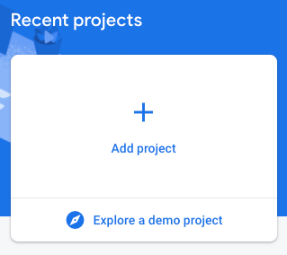

# Chapter 8: Backend as a Service (BaaS), Firebase, FlutterFire

In this chapter, we'll get familiar with the term *BaaS*, the services of Firebase, and Firebase's libraries that we can use to integrate some of those services into our Flutter apps. We'll then see some Firebase services in action in a real-time updating forum application.

## What's BaaS?

Backend-as-a-Service (BaaS) is a cloud service model where all of an apps' back-end services are outsourced to a service provider. BaaS providers deliver and maintain all APIs and libraries needed to use their services.

## What's Firebase?

Firebase is Google's BaaS platform. It provides many pre-built services, including:

- Authentication
- File storage (Storage)
- Database (Firestore, Realtime Database)
  - NoSQL, collection and document based database
- Crash reporting (Crashlytics)
- Analytics
- etc.

## Getting started with Firebase

To use Firebase services, all we need to have is a Google account. If we visit https://firebase.google.com in a browser after signing in with a Google account, we can access our Firebase console right away.

### Project setup - Firebase console project

When entering the Firebase console, we can see a dashboard with our existing projects, and we can also create a new one from there.

https://firebase.flutter.dev/docs/overview/

No FlutterFire love for Windows and Linux yet, so the desktop support is for macOS only at the writing of this material.

https://firebase.google.com/

Show around the Firebase Console.

Create a new app.

Show menu.

Enable:

- Authentication
- Firestore
- Storage
- Crashlytics
- Analytics

### Embedder project setup

#### Android

https://firebase.flutter.dev/docs/installation/android

Firebase app reg, google-services.json

android/build.gradle

android/app/build.gradle

MULTIDEX!!! API21+

#### iOS

https://firebase.flutter.dev/docs/installation/ios

Firebase app reg, GoogleService-Info.plist

Needs XCode to be able to add it to the project.
https://firebase.flutter.dev/docs/installation/ios#installing-your-firebase-configuration-file

#### Web

https://firebase.flutter.dev/docs/installation/web

Displaying images on the web, CORS

https://flutter.dev/docs/development/platform-integration/web-images

## FlutterFire

(Rt Database has no Web support, but use Firestore instead!)
Crashlytics has no Web support :(

### Authentication

We have to enable it on the console. For the sake of simplicity, we'll use the email/password login method.

### Firestore

https://firebase.flutter.dev/docs/firestore/usage/

dispose - we're using StreamBuilders, so there's no need to manually dispose the subscriptions

### Storage

File storage, the folder structure is flexible.

Easy to upload and download/reference files.

### Crashlytics

Crash reporting.

### Analytics

Scarce documentation
https://pub.dev/packages/firebase_analytics

https://firebase.google.com/docs/analytics/debugview#android

adb shell setprop log.tag.FA VERBOSE
adb shell setprop log.tag.FA-SVC VERBOSE
adb logcat -v time -s FA FA-SVC

adb shell setprop debug.firebase.analytics.app <package_name>
adb shell setprop debug.firebase.analytics.app .none.