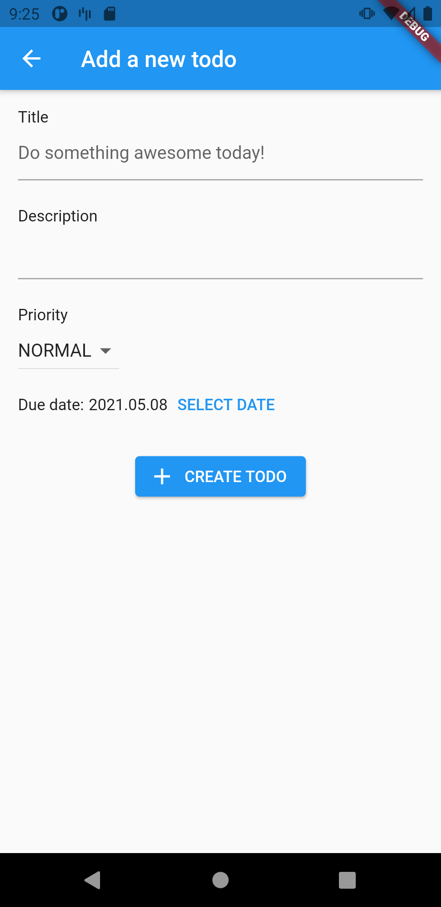
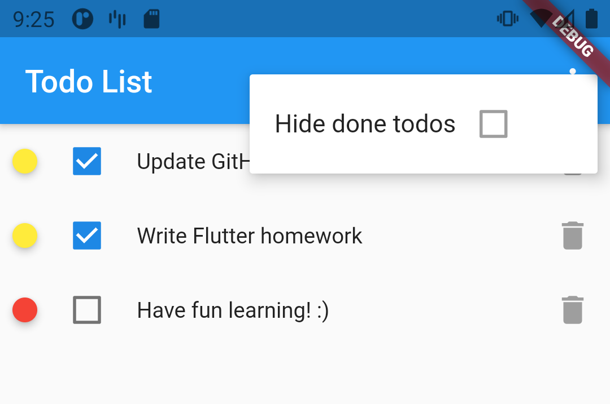

# Chapter 9: Persistent data storage

We've seen how we can handle data in apps involving user input and network communication in the previous chapters.

While many apps depend on network communication and memory caching, there are use-cases where local data storage - as in, storing data persistently on the device our app is running on - has to be implemented. Such use-cases could be as simple as storing the user's settings or a login token and as large and complex as supporting full-, or semi-offline features, including synchronizing local changes in data with a backend.

Let's take one step back to the basics. In this chapter, we'll look at persistent data storage options available in Flutter, including file handling, key-value stores, and relational databases.

## File operations

The project we'll be looking at now is the [image_downloader](../projects/chapters/chapter_09/image_downloader) demo app.

The app can save random images from [Picsum](https://picsum.photos/) as files into a specific directory on the filesystem and display the downloaded images in a grid. The app is designed to work on Android and iOS.

<p align="center"></p>

> We only have one GET network request for retrieving images in this simple app. We don't use the higher-level libraries discussed in [chapter 8](08.md). This approach is, in fact, perfectly fine for prototyping and small projects.

### path and path_provider

While handling file and directory paths may seem like a basic task with modern native frameworks, doing so in a cross-platform manner has many challenges. Just think about different path separator characters or dedicated folders on each platform. 

Fortunately, the Flutter platform team provides a couple of packages to help us overcome this complexity with ease.

The [path](https://pub.dev/packages/path) package provides top-level functions for manipulating file system paths, like `join()` and `split()`.  After adding *path* to the project's *pubspec.yaml* file as a dependency, we can import it with a prefix in any *.dart* file to start using the provided functions.

```dart
import 'package:path/path.dart' as path;
```

With that import in place, we can use *path* like below (example taken from *image_downloader*'s [main.dart](../projects/chapters/chapter_09/image_downloader/lib/main.dart) file):

```dart
path.join(directory.path, IMAGES_DIR))
```

The [path_provider](https://pub.dev/packages/path_provider) package, on the other hand, gives us functions that can return paths to specific, dedicated folders on the supported platforms, like `Downloads`, `Documents`, and also the app-specific folders. We can add *path_provider* to a project the same way as we added *path*. 

We can find an example for using one of path_provider's methods - [`getApplicationDocumentsDirectory()`](https://pub.dev/documentation/path_provider/latest/path_provider/getApplicationDocumentsDirectory.html) - in the `_getImageDirectory()` function of `_ImageDownloaderPageState`.

```dart
Future<Directory> _getImagesDirectory() async {
  final directory = await getApplicationDocumentsDirectory(); // <- Here
  return Directory(path.join(directory.path, IMAGES_DIR)).create();
}
```

`getApplicationDocumentsDirectory()`  returns platform-specific directory paths:

- On iOS, it uses the `NSDocumentDirectory` API to get the folder where the current app may place user-generated data.
- On Android, it uses `Context.getDataDirectory()` to get the app's own private data storage folder.
- On other platforms, this method throws a `MissingPlatformDirectoryException`.

Some other *path_provider* functions to check out:

- [`getApplicationSupportDirectory()`](https://pub.dev/documentation/path_provider/latest/path_provider/getApplicationSupportDirectory.html)
- [`getDownloadsDirectory()`](https://pub.dev/documentation/path_provider/latest/path_provider/getDownloadsDirectory.html) 

> For demonstration purposes, we use a simple import for *path_provider*, and we call `getApplicationDocumentsDirectory()` without a prefix. However, we could import *path_provider.dart* with an alias and use its functions with a prefix just as we did with *path*.

There's one more thing to discuss that makes *image_downloader* tick, and that's the `dart:io` package. Like in most programming languages, a [`File`](https://api.flutter.dev/flutter/dart-io/File-class.html) instance in Dart is a reference to a file on a file system with the ability to manipulate the referenced file. The same applies to the [`Directory`](https://api.flutter.dev/flutter/dart-io/Directory-class.html) class and directories.

With this knowledge in our pockets, let's take a look at `_ImageDownloaderPageState`'s three functions that drive the *image_loader* app.

First of all, `_getImageDirectory()` is responsible for creating a `Directory` object that references the directory we'll be storing the downloaded images in and also from where we'll be loading them to be shown on the UI. 

```dart
Future<Directory> _getImagesDirectory() async {
  final directory = await getApplicationDocumentsDirectory();
  return Directory(path.join(directory.path, IMAGES_DIR)).create();
}
```

The `_downloadNewImage()` function downloads a new random image from Picsum, stores it under a random name (a generated [UUID](https://en.wikipedia.org/wiki/Universally_unique_identifier) + ".jpg"), and refreshes the UI state afterward.

```dart
Future<void> _downloadNewImage() async {
  final response = await http.get(Uri.parse("https://picsum.photos/400")); // Query the image
  final imagesDir = await _getImagesDirectory(); // Get the target directory
  final filePath = path.join(  // Create the absolute path the file will be saved to
    imagesDir.path,
    "${uuidGenerator.v4().toString()}.jpg",
  );
  final file = File(filePath); // Create a File object for file handling
  await file.writeAsBytes(response.bodyBytes); // Write the bytes of the image to the file
  print("Image downloaded to: $filePath");
  setState(() {
    _imageFiles = _loadImages(); // Refresh the state
  });
}
```

> Note that we've changed the file naming scheme compared to what was seen in the lecture, as that implementation didn't guarantee to generate unique file names on each call. Now we use the [uuid](https://pub.dev/packages/uuid) package to generate random UUIDs for file names.

Last but not least, there's the `_loadImages()` function that returns a `Future<List<File>>` object containing a list of references to the downloaded image files.

```dart
Future<List<File>> _loadImages() async {
  final imagesDir = await _getImagesDirectory();
  return imagesDir
      .list() // Lists immediate subdirectories and files
      .where((element) => element.path.endsWith(".jpg")) // Filter for JPG files
      .map((e) => File(e.path)) // Map FileSystemEntity objects to File objects
      .toList(); // Convert resulting Iterable<File> to List<File>
}
```

> Note that we use the same asynchronous data loading logic with `FutureBuilder` as we did in [chapter 8](08.md). Namely, storing a `Future` reference in a `StatefulWidget`'s state and passing that reference to a `FutureBuilder` in the `build()` method.

## A todo app without persistent storage

In this section, we'll be looking at variations of a todo list application. The [todo_starter](../projects/starters/chapter_09/todo_starter) project contains the base framework that we can extend with persistent storage solutions. While we can delete existing todos and create new ones, the same three todos will show up again after restarting the app.

<p align="center">
  
  
  
</p>

##  The todo app with persistent key-value storage

Before diving into how we can persist our todos, we'll take a look at an implementation of hiding already done todos with a "switch" (which will be a `Checkbox`). The project for this section is [todo_shared_prefs](../projects/chapters/chapter_09/todo_shared_prefs).

<p align="center">
  
  
</p>

The value for the setting that controls the visibility of done todos will be persisted between app restarts. We'll use the first-party [shared_preferences](https://pub.dev/packages/shared_preferences) package to store a `Boolean` value referenced with a `String` key.

The *shared_preferences* package wraps platform-specific persistent key-value storage solutions that can store simple data, like `bool`s, `int`s, `String`s, etc.

> To be more specific, shared_preferences wraps the following solutions on the supported platforms:
> - **Android:** [SharedPreferences](https://developer.android.com/reference/android/content/SharedPreferences)
> - **iOS/macOS:** [NSUserDefaults](https://developer.apple.com/documentation/foundation/nsuserdefaults)
> - **Web:** [window.localStorage](https://www.w3schools.com/html/html5_webstorage.asp)
> - **Linux/Windows:** a *shared_preferences.json* file in `PathProvider.getApplicationSupportPath()`

After adding the package to our *pubspec.yaml* file and updating the dependencies, we can get a reference to the singleton `SharedPreferences` instance by calling the static `SharedPreferences.getInstance()` function. This function loads the wrapped platform implementation asynchronously, so we have to handle it like any other `Future` that provides data for building the UI. An example for this can be found in [`todos_cubit.dart`](../projects/chapters/chapter_09/todo_shared_prefs/lib/bloc/todos_cubit.dart).

```dart
static const HIDE_DONE_TODOS_KEY = "HIDE_DONE_TODOS";

// ...

Future<void> setDoneTodoVisibility(bool doneTodosVisible) async {
  final prefs = await SharedPreferences.getInstance();
  await prefs.setBool(HIDE_DONE_TODOS_KEY, doneTodosVisible);
  _emitAllTodos();
}

// ...

Future<void> _emitAllTodos() async {
  final allTodos = await _dataSource.getAllTodos();
  final prefs = await SharedPreferences.getInstance();
  final hideDoneTodos = prefs.getBool(HIDE_DONE_TODOS_KEY) ?? false;
  if (!hideDoneTodos) {
    emit(
      TodosLoaded(todos: allTodos, hideDoneTodos: hideDoneTodos),
    );
  } else {
    final todos = allTodos.where((todo) => !todo.isDone).toList();
    emit(
      TodosLoaded(todos: todos, hideDoneTodos: hideDoneTodos),
    );
  }
}
```

In the code snippet above, we use one of the getter functions available for retrieving typed values from `SharedPreferences`, namely `getBool(key)`. If `SharedPreferences` doesn't have a value stored for a key, the getter functions will return `null` for that key.

Let's take a detour and see how we can implement the menu item that will set the state of our `bool` setting in `SharedPreferences`.

```dart
@override
Widget build(BuildContext context) {
  return BlocProvider<TodosCubit>(
    create: (context) {
      return TodosCubit(
        context.read<DataSource>(),
      );
    },
    child: Scaffold(
      appBar: AppBar(
        title: const Text("Todo List"),
        actions: [
          BlocBuilder<TodosCubit, TodosState>(
            builder: (context, state) {
              if (state is Loading) {
                return Container();
              } else if (state is TodosLoaded) {
                return PopupMenuButton<String>(
                  onSelected: (_) {
                    final cubit = context.read<TodosCubit>();
                    cubit.setDoneTodoVisibility(!state.hideDoneTodos);
                  },
                  itemBuilder: (context) {
                    return [
                      PopupMenuItem(
                        value: TodosCubit.HIDE_DONE_TODOS_KEY,
                        child: Row(
                          children: [
                            if (state.hideDoneTodos) ...{
                              const Text("Show done todos"),
                            } else ...{
                              const Text("Hide done todos"),
                            }
                          ],
                        ),
                      ),
                    ];
                  },
                );
              } else {
                return Container();
              }
            },
          ),
        ],
      ),
      body: // ...
  );
}
```

We can build `AppBar` menu actions with any widget - we're probably quite used to this by now. However, some widgets play nicely together in this context and make it easy to implement `AppBar` popup menus defined by Material Design. The ones we're using here are [`PopupMenuButton`](https://api.flutter.dev/flutter/material/PopupMenuButton-class.html) and [`PopupMenuItem`](https://api.flutter.dev/flutter/material/PopupMenuItem-class.html). The single item we're building uses a `BlocBuilder` to get the value stored in the state (implicitly in `SharedPreferences`) and build the menu item accordingly. The popup menu selection callback has to be passed to the `PopupMenuButton`, and it will be called with the object we pass to `PopupMenuItem.value` - which is a String in our case.

With this set, the `TodosCubit` will handle emitting the correct - filtered or unfiltered - list of todos.

```dart
Future<void> _emitAllTodos() async {
  final allTodos = await _dataSource.getAllTodos();
  final prefs = await SharedPreferences.getInstance();
  final hideDoneTodos = prefs.getBool(HIDE_DONE_TODOS_KEY) ?? false;
  if (!hideDoneTodos) {
    emit(
      TodosLoaded(todos: allTodos, hideDoneTodos: hideDoneTodos),
    );
  } else {
    final todos = allTodos.where((todo) => !todo.isDone).toList();
    emit(
      TodosLoaded(todos: todos, hideDoneTodos: hideDoneTodos),
    );
  }
}
```

Now it's time to see where the hardcoded todos are coming from and how to alter that implementation to support storing todos persistently between app restarts.

## Storing todos persistently

Staying with the [todo_shared_prefs](../projects/chapters/chapter_09/todo_shared_prefs) project, let's look at the source of the current todos: [`MemoryTodoRepository`](../projects/chapters/chapter_09/todo_shared_prefs/lib/data/database/memory/memory_todo_repository.dart) in memory_todo_repository.dart.

The first thing to notice is that `MemoryTodoRepository` implements `TodoRepository<Todo>`'s interface.

```dart
abstract class TodoRepository<T> {
  Future<void> init();

  Future<List<T>> getAllTodos();

  Future<T> getTodo(int id);

  Future<void> upsertTodo(T todo);

  Future<void> deleteTodo(T todo);
}
```

> There is no explicit `interface` keyword in Dart. Instead, every class has an implicit public interface that  other classes can implement.

`TodoRepository` is a generic abstract class that defines an interface - multiple abstract functions - for accessing and storing todo data. This concept is important because components using `MemoryTodoRepository` - in this case, `DataSource` - can depend on `TodoRepository` instead without knowing how its interface is implemented. In a nutshell, we can easily replace `MemoryTodoRepository` with another `TodoRepository` implementation without modifying most of the application code in the process.

> What we're discussing here is how to apply the [Liskov substitution principle](https://en.wikipedia.org/wiki/Liskov_substitution_principle) (the L in [SOLID](https://en.wikipedia.org/wiki/SOLID) in practice. Therefore, the method demonstrated here is not limited to Dart or Flutter; it's widely used in software engineering.

Another concept to mention is different data representations. We're only using the `Todo` class to represent todos in the app's current state. Doing this can be fine as long as we don't introduce, for example, networking or database libraries to a project.

As we're exploring the topic of persistent data storage, let's add a database handling package to the project and make some adjustments to support storing todos in a relational ([SQLite](https://sqlite.org/index.html)) database.

From this point onwards, we'll be discussing code found in the todo_floor project.

> **Intermission: [Object-relational mapping (ORM)](https://en.wikipedia.org/wiki/Object%E2%80%93relational_mapping)**
>
> ORM is a technique for converting data between incompatible type systems. In our case, on a broader scale, this means that we'll convert Dart classes to SQLite database entities and back while also describing tables and queries with classes, functions, annotations, and code generation. 

As the project's name suggests, we use the [Floor](https://pub.dev/packages/floor) package to build our persistent storage solution in this example. Floor is based on the Room library available for Android native development. Even the name "floor" is a clever take on Room, as it starts with an F and it's part of a room. We can define tables and entities by annotating simple data holder classes with the `@Entity` annotation and set other parameters and constraints using the package's other relevant annotations. The following code is from [floor_todo.dart](../projects/chapters/chapter_09/todo_floor/lib/data/database/floor/floor_todo.dart):

```dart
import 'package:floor/floor.dart';

@Entity(tableName: "todo")
class FloorTodo {
  @PrimaryKey(autoGenerate: true)
  int? id;
  String title;
  String dueDate;
  int isDone;
  String description;
  int priority;

  FloorTodo({
    this.id,
    required this.title,
    required this.dueDate,
    required this.isDone,
    required this.description,
    required this.priority,
  });
}
```

The `FloorTodo` class represents the only table we need to store these simple todo entities. Floor generates an actual, valid SQLite table creator script based on the parameters of the `@Entity` annotation, and the properties of the class, also taking the annotations on the properties (like `@PrimaryKey`) into account. 

> The SQLite script generated for this example FloorTodo class is the following:
>
> `CREATE TABLE IF NOT EXISTS `todo` (`id` INTEGER PRIMARY KEY AUTOINCREMENT, `title` TEXT NOT NULL, `dueDate` TEXT NOT NULL, `isDone` INTEGER NOT NULL, `description` TEXT NOT NULL, `priority` INTEGER NOT NULL)`
>
> Fortunately, we don't have much to do with it, as Floor takes care of creating and maintaining the tables for us in generated code.

This `FloorTodo` class is our *database model representation* of a todo, on top of the `Todo` class that we already had before. We'll call the latter the *domain model representation* of a todo.

Next, we need to have a data access object (DAO) to define how we can access and modify data in our database. The DAO classes are the places where we define our *queries*. Using Floor, we have to write actual SQLite queries ourselves most of the time. Let's have a look at floor_todo_repository.dart and the `FloorTodoDao` class:

```dart
import 'package:floor/floor.dart';

import 'floor_todo.dart';

@dao
abstract class FloorTodoDao {
  @Query('SELECT * FROM todo')
  Future<List<FloorTodo>> getAllTodos();

  @Query('SELECT * FROM todo WHERE id = :id')
  Future<FloorTodo?> getTodo(int id);

  @Query("DELETE FROM todo WHERE id = :id")
  Future<void> deleteTodo(int id);

  @Insert(onConflict: OnConflictStrategy.replace)
  Future<void> upsertTodo(FloorTodo todo);
}
```

There are a few annotations to discuss here:
- `@dao` is for letting the code generator know that this is a DAO class
- `@Query` on a method makes a connection between a function and the query it represents
- `@Insert` is a shortcut for doing INSERT queries
  - `OnConflictStrategy.replace` means that whenever we want to insert a todo with an already existing ID, the existing entity will be updated with the new values instead of inserting a new todo (hence the "conflict" in the name). This operation is called an *upsert* operation - an *insert*, which behaves like an *update* on conflict.

> Note: We implemented the *delete* functionality as a `@Query` to delete todos by passing only an ID as a parameter. There's a `@delete` annotation for cases when we want to give a whole todo object as a function parameter.

The `FloorTodoDao` class could look familiar, as its public interface resembles the `TodoRepository` class' interface. That's no coincidence; we'll get back to this in a bit.

The last thing we need to do to get our database up and running is wiring the `FloorTodo` class and the `FloorTodoDao` class up within a class representing our database, or more precisely, our database *connection*. This is where the `FloorTodoDatabase` class comes into play.

```dart
import 'dart:async';

import 'package:awesome_todo_app/data/database/floor/floor_todo.dart';
import 'package:floor/floor.dart';
import 'package:sqflite/sqflite.dart' as sqflite;

import 'floor_todo_dao.dart';

part 'floor_todo_database.g.dart';

@Database(
  version: 1,
  entities: [
    FloorTodo,
  ],
)
abstract class FloorTodoDatabase extends FloorDatabase {
  FloorTodoDao get todoDao;
}
```

There are a few things that are mandatory to do to make Floor generate our database handling implementation:

 - The database class has to extend `FloorDatabase`.
 - We have to annotate the database class with the `@Database` annotation and pass a version number and the list of entity classes we want to include.
 - We also have to [add some imports manually](https://pub.dev/packages/floor#4-create-the-database).
     - Of course, besides those mandatory imports, we have to add imports for everything we use in the file normally.
 - There has to be a `part` notation to make the generator work like we've seen before in chapter 4.

With the database setup complete, all we need to do is to run either the `flutter pub run build_runner build` or the `flutter pub run build_runner watch`  command to generate the database handling implementation.

At this point, we're close to wiring up this new implementation in place of the previous, in-memory storage solution. Let's look at the `FloorTodoRepository` class:

```dart
class FloorTodoRepository implements TodoRepository<FloorTodo> {
  late FloorTodoDao todoDao;

  @override
  Future<void> init() async {
    final database = await $FloorFloorTodoDatabase
        .databaseBuilder("floor_todo.db")
        .build(); // This is how we can initialize our database
    todoDao = database.todoDao; // But practically we're using DAOs to manipulate data in it
  }

  @override
  Future<List<FloorTodo>> getAllTodos() {
    return todoDao.getAllTodos();
  }

  @override
  Future<FloorTodo> getTodo(int id) async {
    final todo = await todoDao.getTodo(id);
    if(todo == null) {
      throw Exception("Invalid TODO ID");
    } else {
      return todo;
    }
  }

  @override
  Future<void> deleteTodo(FloorTodo todo) {
    return todoDao.deleteTodo(todo.id ?? -1);
  }

  @override
  Future<void> upsertTodo(FloorTodo todo) {
    return todoDao.upsertTodo(todo);
  }
}
```

This time around, `FloorTodoRepository` is responsible for initializing the database and delegate its every other function to the wrapped `FloorTodoDao`.

We have to modify the `DataSource` class to use the new `TodoRepository<FloorTodo>`'s features. Now, let's think about an earlier section of this material, where we discussed the need for different data model representations of todos - `Todo` (domain model) and `FloorTodo` (database model). Every component that `DataSource` depends on uses the `FloorTodo` class, and every component that depends on `DataSource` uses the `Todo` class. There's `DataSource` in the middle, and, as we can see in the example below, it takes care of mapping between the two representations:

```dart
Future<List<Todo>> getAllTodos() async {
  final todos = await database.getAllTodos();
  return todos.map((floorTodo) => floorTodo.toDomainModel()).toList();
}

Future<Todo> getTodo(int id) async {
  final floorTodo = await database.getTodo(id);
  return floorTodo.toDomainModel();
}

Future<void> upsertTodo(Todo todo) async {
  return database.upsertTodo(todo.toDbModel());
}

Future<void> deleteTodo(Todo todo) async {
  return database.deleteTodo(todo.toDbModel());
}

Future<void> setTodoDone(Todo todo, bool isDone) async {
  return database.upsertTodo(todo.toDbModel()..isDone = isDone ? 1 : 0);
}

extension TodoToFloorTodo on Todo {
  FloorTodo toDbModel() {
    return FloorTodo(
        id: this.id,
        title: this.title,
        description: this.description,
        priority: this.priority.index,
        isDone: this.isDone ? 1 : 0,
        dueDate: getFormattedDate(this.dueDate));
  }
}

extension FloorTodoToTodo on FloorTodo {
  Todo toDomainModel() {
    TodoPriority priority;
    switch (this.priority) {
      case 0:
        priority = TodoPriority.LOW;
        break;
      case 1:
        priority = TodoPriority.NORMAL;
        break;
      case 2:
        priority = TodoPriority.HIGH;
        break;
      default:
        throw ArgumentError(
            "Invalid Todo priority encountered while mapping database object to domain object");
    }
    return Todo(
        id: this.id,
        title: this.title,
        description: this.description,
        priority: priority,
        isDone: this.isDone == 1 ? true : false,
        dueDate: parseDate(this.dueDate));
  }
}
```

The only thing left to do is to adapt the creation of our single DataSource instance at the startup of our app to the new implementation in [main.dart](../projects/chapters/chapter_09/todo_floor/lib/main.dart):

```dart
void main() async {
  WidgetsFlutterBinding.ensureInitialized();

  final dataSource = DataSource(FloorTodoRepository()); // <- Here

  await dataSource.init();

  runApp(
    DataSourceProvider(
      dataSource: dataSource,
      child: AwesomeTodoApp(),
    ),
  );
}
```

And it's a wrap! 

## Conclusion

Notice how we changed implementations in the dependencies of `DataSource` *without ever touching the UI code*. Segmenting our app into different architecture layers hold this king of power. We'll learn more about a more complex layered architecture and an implementation in [chapter 12](12.md).

Also, we've seen how we can implement relational database-based persistent data storage with the Floor library. Our awesome todo list app now persists todos between app restarts.

Run the app and see for yourselves!
