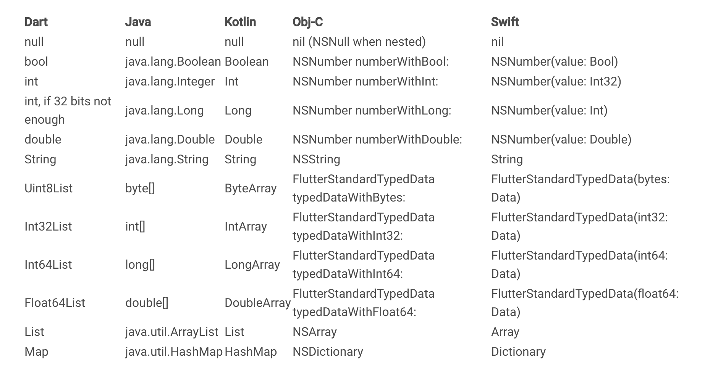

# Chapter 11: How to use Platform-specific APIs with Platform Channels and testing Flutter Apps  
  
In the previous chapters we've learned how could we use Flutter APIs. We also got tons of plugins that help us to provide native features.  
  
## Platform-specific APIs  
What does exactly a native feature mean? The native features are APIs that we can use platform-specifically. The following list shows some of the key platform-specific features:  
- using the **camera**,  
- using the **microphone**,  
- access to location data from **GPS** and show it with Google Maps,  
- access to the device **secure storage**,  
- access to **motion sensors**,  
- access to **humidity sensor**,
- access to **Bluetooth sensor**,  
- access to **NFC chip**,
- etc.  
  
Sometimes we need to use one of them and maybe there is no plugin available.  
  
  
Fortunately, using the `Platform channels`, we could easily run platform native code (code written in `Objective C`, `Swift`, `Java` or `Kotlin`).  
  
### Platform Channels  
Flutter gives us platform channels as a bridge between the client (_UI_) and host (_platform_) and we could pass events through them.  
  
The following diagram gives an overview of Platform channels architecture.  
   
  
  
As we can see in the diagram, we could send events using `MethodChannel` from the Flutter to native and vice versa.  
  
> Note that sending events is an asynchronous process in the Flutter's Dart side, but despite this, whenever we invoke a channel method, we must invoke that method on the platform's UI (main) thread.  
  
  
#### Type support  
The standard platform channels need a **name** and a **codec** for *serializing* / *deserializing* messages to binary form and back. Dart platform channel types and codecs are illustrated in the following table:  
  
  
#### Sending a Method invoking from Flutter  
Firstly we have to create our Platform Channel with adding a unique id like an url like the following snippet:  
```dart  
import 'package:flutter/services.dart'; 
 
const platformChannel = const MethodChannel('hu.bme.aut.flutter/data');  
```  
  
After that we could send a request with calling `invokeMethod()` method with passing the name of method of the native side. Unfortunately, things can go wrong so we should add try-catch block because if the communication with the platform fails for any reason, we want to be prepares to handle that error like this:  
```dart  
try {  
  final String result = await platformChannel.invokeMethod('getPlatformSpecificData');  
  _platformSpecificData = result;  
} on PlatformException catch (error) {  
  _platformSpecificData =  "Failed to get platform specific data: '${error.message}'."; 
}
```  
  
  
#### Running native Android code  
Start by finding the Android host portion of our Flutter application. After that open the `MainActivity.kt` located in **java** or our **kotlin** folder.

Add the following imports:
```dart  
``` 

Inside the MainActivity we have to create and configure our `FlutterEngine`. For that we could override configureFlutterEngine() method of `FlutterActivity` class like this:
  ```dart  
import androidx.annotation.NonNull
import io.flutter.embedding.android.FlutterActivity
import io.flutter.embedding.engine.FlutterEngine
import io.flutter.plugin.common.MethodChannel 


class MainActivity : FlutterActivity() {

    private val CHANNEL = "hu.bme.aut.flutter/data"

    override fun configureFlutterEngine(@NonNull flutterEngine: FlutterEngine) {
        super.configureFlutterEngine(flutterEngine)
        MethodChannel(flutterEngine.dartExecutor.binaryMessenger, CHANNEL).setMethodCallHandler { call, result ->
            // Note: this method is invoked on the main thread.
            // TODO
        }
    }

}
  ``` 

> Don't forget to add the necessary imports by manually this time.  

#### Running native iOS code


#### Add Flutter to an existing mobile app
Flutter could be integrated into our **existing** native Android or iOS application, as a **library** or a **module**.

[Integrate a Flutter module into your Android project](https://flutter.dev/docs/development/add-to-app/android/project-setup)  

  
## Introduction to test Flutter applications  
  
### Unit tests  
  
#### Writing the first unit test  
  
#### Testing model classes  
  
#### Testing Platform Channels  
  
#### Testing BloCs  
  
### Widget tests  
TODO  
  
## Further reading, materials  
  
- [Writing custom platform-specific code](https://flutter.dev/docs/development/platform-integration/platform-channels)  
- [Flutter Platform Channels](https://medium.com/flutter/flutter-platform-channels-ce7f540a104e) by Mikkel Ravn  
- [Intro to Platform Channels: Building an Image Picker in Flutter](https://codewithandrea.com/articles/platform-channels-flutter/) by Andrea Bizzotto  
- [Your Own Image Picker With Flutter Channels](https://www.raywenderlich.com/2882495-your-own-image-picker-with-flutter-channels) by JB Lorenzo  
  
- [Testing Flutter apps](https://flutter.dev/docs/testing)  
- [An introduction to unit testing](https://flutter.dev/docs/cookbook/testing/unit/introduction)  
- [Mock dependencies using Mockito](https://flutter.dev/docs/cookbook/testing/unit/mocking)  
- [An introduction to widget testing](https://flutter.dev/docs/cookbook/testing/widget/introduction)
