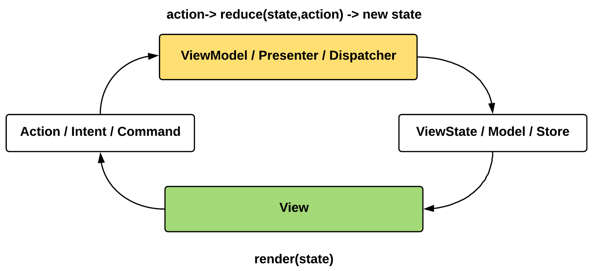
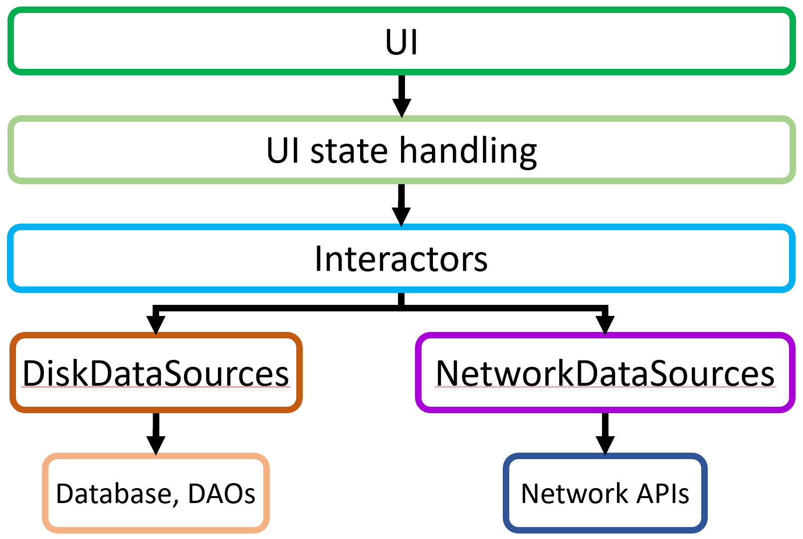
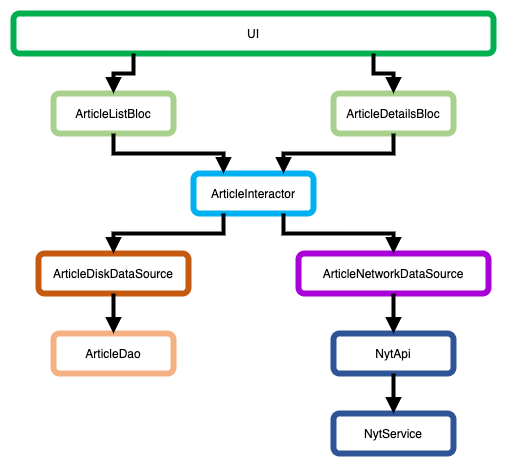
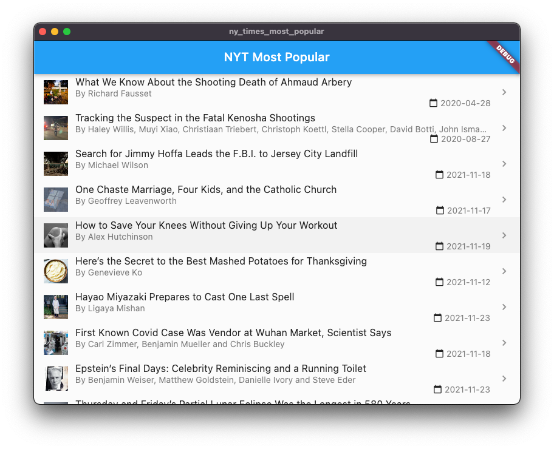
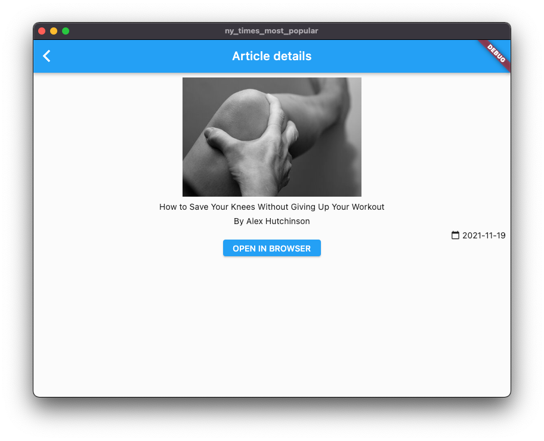

# Chapter 12: App Architecture

In the previous chapters, we've seen a lot of aspects of app development in Flutter. It's time to take a look at one of the many ways to assemble an app with maintainability, extendibility, and testability in mind.

The project we'll be working with is a list-detail app called [New York Times Most Popular](../projects/chapters/chapter_12/ny_times_most_popular), which has a near production-ready architecture complete with network handling, local storage, state handling, and more.

## Unidirectional architectures, data flow

<p align="center"></p>

Architectures that update the presentation (UI) layer of the app by providing state that is transformed by received UI events are called *unidirectional architectures*.

"Unidirectional", because data (events, state, and data to update the state) flows in one direction only, resulting in the UI being always in sync with the current state.

> We already learned in [chapter 6](06.md) that state handling is fundamental when working with Flutter. Actually, the BLoC pattern itself is a fair representation of a unidirectional data flow architecture.
>
> 

## App architecture overview

<p align="center"></p>

> **Attention!** This architecture is just one of the many we can implement and work with - it's actually an amalgamation of the [MVVM](https://en.wikipedia.org/wiki/Model%E2%80%93view%E2%80%93viewmodel) and [MVI](https://www.raywenderlich.com/817602-mvi-architecture-for-android-tutorial-getting-started) architecture models, commonly used in mobile development. There are quite a few other concepts to look out for, like [MobX](https://pub.dev/packages/mobx) and [Redux](https://pub.dev/packages/redux), which were adapted from the JavaScript world.

Layering our app's architecture opens up a world of possibilities and benefits. Each layer has their own responsibilities, and they can be modified without significantly touching the others - at least in theory.

Let's go through each layer's responsibilities:

- **UI**: This is where UI widgets, or more precisely, screens/pages are. They observe immutable state provided by the state handling implementation (e.g.: Provider, Cubit, Bloc, etc.). They also notify the state handlers about input events.
- **UI state handling**: Components related to state management (implemented with Provider, Cubit, Bloc, etc.).They receive events from the UI, call the Interactors when business logic needs to be involved, and update/emit state to the UI accordingly.
- **Interactors**: They contain the business logic of the application. They aggregate and manipulate data received from data sources and perform computations. They aren't tied to screens, but the *domains* and the *functionality* of the app's features. They operate on canonical, *domain* models of the data of the app.
- **Data sources**: They provide the interactors with data from various sources. Sources can be anything, like local databases, a network APIs, key-value stores, system APIs, etc. Data sources are responsible for abstracting away the concrete implementation of storing and retrieving data, and keeping the stored data in a consistent state. Data sources are also responsible for converting between their respective data representations to a canonical, domain layer representation.

> Notice that we have already seen the benefits of having this layering approach in [Chapter 9](/material/09.md), where we replaced an in-memory data storage implementation with one that uses Floor, while only touching things "below" the only  `DataSource` we had there.

## Wiring components up - Dependency injection (and service locator) frameworks

Maintaining the dependencies of each component is a fundamental thing to take into consideration while developing large software systems in an object-oriented way.

The term to keep in mind here is [dependency injection](https://en.wikipedia.org/wiki/Dependency_injection) (DI). In a nutshell, DI means that components (Blocs, Interactors, DataSources, etc.) don't create other components they use (*depend on*), but instead they receive them fom an outside source via *constructor injection*. Constructor injection is just a fancy term for a class getting hold of references of other classes' instances in its constructor while *some other component* provides those references.

A good example of a constructor-injected class is [`ArticleInteractor`](/projects/chapters/chapter_12/ny_times_most_popular/lib/domain/interactor/article_interactor.dart):

```dart
class ArticleInteractor {
  final ArticleDiskDataSource _articleDiskDataSource;
  final ArticleNetworkDataSource _articleNetworkDataSource;

  ArticleInteractor(
    this._articleDiskDataSource,
    this._articleNetworkDataSource,
  );

  Future<List<Article>> getArticles() async {
    return await _articleDiskDataSource.getAllArticles() ?? [];
  }

  Future<void> refreshArticles() async {
    final articles = await _articleNetworkDataSource.getArticles();

    await _articleDiskDataSource.saveArticles(articles ?? []);
  }
  // ...
}
```

`ArticleInteractor` *depends on* an instance of  `ArticleDiskDataSource` and an instance of `ArticleNetworkDataSource` to do its job.

That dependency-providing *other component*  is called a *DI framework*. DI frameworks usually come as libraries, or we can implement one ourselves (which is generally not the most time-efficient thing to do, but the option is there).

> Be careful not to confuse the project-level dependency manager (e.g. pub for Flutter, Gradle for Android, and, well, Xcode itself for iOS) with a DI framework. These are completely different things than what we're discussing here.

A DI framework usually requires us to declare the *dependency graph* - the definition of which component depends on which other components, so that the DI framework can construct each and every component when it is "asked" to do so.

The New York Times Most Popular sample app uses [get_it](https://pub.dev/packages/get_it), one of the rather lightweight libraries available for Flutter DI. In fact, it's so lightweight, that it is not even a proper, classic DI library. It is a [*service locator*](https://en.wikipedia.org/wiki/Service_locator_pattern), meaning - in a nutshell - that we can register our components in its registry (usually represented internallly as a `Map`) and get a reference for those component instances in out architecture code.

The sample app's DI setup and graph declaration is in the [di_utils.dart](/projects/chapters/chapter_12/ny_times_most_popular/lib/di/di_utils.dart) file. The `initDependencies()` function is responsible for setting up the dependencies in the `injector` object:

```dart
final injector = GetIt.instance;

void initDependencies() {
  injector.registerSingleton<NytApi>(NytService());

  injector.registerSingleton(
    ArticleNetworkDataSource(injector<NytApi>()),
  );

  injector.registerSingletonAsync<ArticleDao>(() async {
    final database = await $FloorFloorArticleDatabase
        .databaseBuilder("nyt_database.db")
        .build();
    return database.articleDao;
  });

  injector.registerSingletonAsync(
    () async {
      return ArticleDiskDataSource(
        injector<ArticleDao>(),
      );
    },
    dependsOn: [ArticleDao],
  );

  injector.registerSingletonAsync(
    () async {
      return ArticleInteractor(
        injector<ArticleDiskDataSource>(),
        injector<ArticleNetworkDataSource>(),
      );
    },
    dependsOn: [ArticleDiskDataSource],
  );

  injector.registerFactory(
    () => ArticleListBloc(
      injector<ArticleInteractor>(),
    ),
  );

  injector.registerFactory(
    () => ArticleDetailsBloc(
      injector<ArticleInteractor>(),
    ),
  );
}
```

The graphical representation of the app's dependency graph:



> Notice the similar color coding and structure of the diagram above and the general architecture overview diagram we've seen earlier in this chapter.

With this setup, the UI parts of the app should only care about getting hold of instances of the necessary *\*Bloc* components. Everything "below" those is handled by the DI framework.

With *get_it*, this comes down to a simple-syntax call of `injector<Type>()` where we want an instance of some component - where `injector` can be called anything, as in this example it's just a top-level constant for canonically accessing `GetIt.instance`.

An example of getting an  `ArticleListBloc` reference in the UI can be found in the `article_list.dart` file:

```dart
class ArticleListPage extends StatelessWidget {
  @override
  Widget build(BuildContext context) {
    return Scaffold(
      appBar: AppBar(
        title: Text("NYT Most Popular"),
      ),
      body: BlocProvider(
        create: (context) => injector<ArticleListBloc>(), // <- Here
        child: BlocListener<ArticleListBloc, ArticleListState>(
          listener: (context, state) {
            if (state is Error) {
              context.showSnackBar(
                content: Text("Failed to refresh articles!"),
              );
            }
          },
			// ...
}
```

> For the record, get_it is just a bit smarter than us defining and setting up `InheritedWidget`s on our own. But that little extra smartness can save a lot of time on our end.

## DI and replaceable components

The example app, in its current state, can't be run in the browser and on Linux/Windows at all. The culprit here is `Floor`, as - at the time of writing this chapter - it only supports Android, iOS, and macOS.

However, if we changed the persistent data handling components - everything "below" `ArticleDiskDataSource` - for an implementation that *does support* the remaining platforms (e.g. a with a NoSQL solution, like [hive](https://pub.dev/packages/hive)), this app could run on any platform that Flutter is enabled on.

As a bonus, we would only have to change that specific part of the code - as long as `ArticleDiskDataSource`'s interface stays the same, of course. We've seen the same thing in [Chapter 9](09.md).

## DI and testing

Building our apps with DI in mind has a big advantage (besides our components being created hierarchically and that they will bea easily replaceable), and that's the high level of [unit-testability](https://en.wikipedia.org/wiki/Unit_testing) of each component. We covered unit testing in [Chapter 11](11.md).

There are some example tests for the `ArticleInteractor` and the `ArticleDetailsBloc` in the [`test`](/projects/chapters/chapter_12/ny_times_most_popular/test) folder of the example project.

## Bonus: running the app on macOS

As we already know, the Floor package doesn't support the web and Linux/Windows desktop platforms.

However, Floor does support building for macOS. With some extra permission setup in the `macos` embedder project (in the [DebugProfile.entitlements](/projects/chapters/chapter_12/ny_times_most_popular/macos/Runner/DebugProfile.entitlements) and [Release.entitlements](/projects/chapters/chapter_12/ny_times_most_popular/macos/Runner/Release.entitlements) files) we can enable running the app even on macOS.

> Note that the app in its current state is not desktop-friendly. The pull-to-refresh gesture on the list view isn't available on the web and on desktop, so it would be a good idea to       

Details of the setup can be found here: [macOS-specific support](https://docs.flutter.dev/desktop#macos-specific-support)

|  |  |
| ---------------------------------------------------------- | ------------------------------------------------------------ |

## But... Why so serious?

To understand why this complexity - multiple architectural layers, DI, classes for events and states, even as something little as a well-defined package structure - is needed in modern applications, think of apps with multiple hundreds of screens and use-cases, like mobile banking apps, social media clients, etc. There can even be hundreds of people working on the same codebase day-by-day.

Large projects like those need *structure* and *rules* developers like us can follow while doing our jobs. The patterns we follow, the code that we write, and even the documentation we have to read and create sometimes are not just products, but communication between fellow engineers, colleagues, and community members.

This is a general truth not just for Flutter apps, but for all software projects and engineers out there.

# Closing thoughts

Dear reader,

If you made it this far in the material (on the long way ;) ), we have good news for you. Hopefully, you've learned a lot about Dart, Flutter, and maybe even modern software engineering as a whole in this semester.

We've started with the basics of Dart and Flutter and went all the way to discussing production-grade, life-like application architectures.

Thank you for coming on this journey and have fun writing Flutter apps!

\- The lecturers


